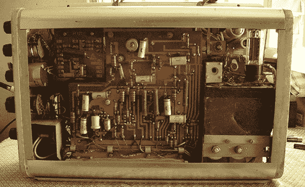

# 拆除 1963 年的超声波机器

> 原文：<https://hackaday.com/2013/08/18/tearing-down-an-ultrasound-machine-from-1963/>

老式电子产品令人敬畏，旧的医疗设备更是如此。当[墨陶]拿到一台旧超声波机器时，他知道他必须把它拆开。即使他不能把它恢复到正常工作状态，里面的部件在制造出来 50 年后也能成为一堂伟大的历史课。

这种非常原始的超声波机器由西门子在 1963 年开始销售，作为“事故后快速评估脑出血的诊断超声波设备”这只是刚刚进入晶体管时代，从[墨陶]的拆卸来看，几乎整个设备都是由真空管、电容器和电阻器组成的。该设备中唯一的固态元件是电源中的桥式整流器。令人印象深刻的东西，即使在今天。

最后，[墨陶]认为这个设备不值得修理。PCB 上到处都是裂缝，而且他也没有任何奇怪的专有配件。尽管如此，这个垃圾场的分数(Murtaugh)净得了一堆旧电子管和其他部件，以及一个漂亮的 CRT，带有一个美妙的“西德制造”的标签。