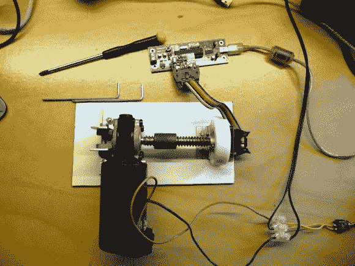

# 更新:测试磁性旋转编码器的准确性

> 原文：<https://hackaday.com/2013/08/20/update-testing-the-accuracy-of-a-magnetic-rotary-encoder/>

不久前，我们展示了[LongHairedHacker]设计的磁性旋转编码器。该系统的核心是一个 AS5043 磁性旋转传感器，价格从 6.5 美元到 11 美元不等，精度为 10 位。因为我们想检验他的设计是否真的有效，他为它做了一个[测试台](http://sindri.sebastians-site.de/MagneticRotaryEncoder/Accuracy)。

对于 360 度，10 位精度意味着 0.175 的准确度，这是用传统测量设备无法检查的。他想到的第一个方法是在编码器轴上安装一面镜子，然后用激光束对准它。激光束会在房间内大范围反射，但所需的最小距离是 5 米(16 英尺)。因此，他倾向于在传感器上安装一个电机，以给定的速度旋转并测量传感器的输出。

在文章的第一部分，[LongHairedHacker]给出了数学公式，解释了他的设置和传感器可能出现的各种误差。然后，他继续进行测试，使用基于 ATMEGA8 的电路板将测得的位置发送到他的计算机。需要注意的是，[long airedhacker]目前使用他的计算机上两次接收测量之间的时间作为时间基准，但他计划在未来为他的板上的数据打上时间戳。尽管如此，他还是设法用他的简单测试台测量了平均 0.179 的精确度，这非常接近制造商的规格。

这里是我们关于他的传感器的原始帖子的链接。