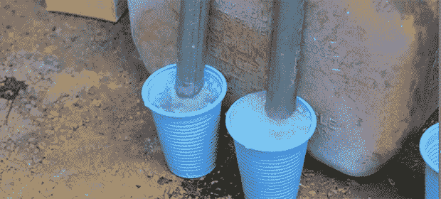

# 镀锌导管不会产生金属烟雾热

> 原文：<https://hackaday.com/2013/08/19/on-not-getting-metal-fume-fever-with-galvanized-conduit/>

你可以在世界各地的家庭仓库和建筑工地找到镀锌钢管。如果不是因为这些相对薄壁的钢管上覆盖了一层锌保护层，它们会成为很好的结构构件。这层镀锌层导致蹩脚的焊接和一些可怕的烟雾，但坏蛋、电视名人和杰出黑客[Hackett]向我们展示了如何用任何五金店都可以买到的化学品来剥离这些管道的镀锌层。

由于这些管道上的镀锌覆盖了内部和外部，打磨掉这些管道上的小层锌是非常困难的。为了确保他能把管子里的锌全部清除掉，[哈克特]决定用一个装满盐酸的杯子对管子进行化学剥离。

这个过程非常简单——在杯子里装满酸，浸泡管道末端，然后用小苏打清洗所有东西。这是一个将废管道变成有用材料的好方法，可以做一个很酷的纸型火山，还可以避免感冒

[https://www.youtube.com/embed/8Tld3onsUVE?version=3&rel=1&showsearch=0&showinfo=1&iv_load_policy=1&fs=1&hl=en-US&autohide=2&wmode=transparent](https://www.youtube.com/embed/8Tld3onsUVE?version=3&rel=1&showsearch=0&showinfo=1&iv_load_policy=1&fs=1&hl=en-US&autohide=2&wmode=transparent)