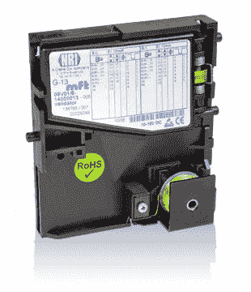

# 黑客硬币收藏

> 原文：<https://hackaday.com/2013/08/20/hacking-coin-collection/>

收集支付硬币的设备通常使用标准化的硬币接收器，如图所示。这些设备使用一种称为 ccTalk 的协议，让系统知道插入了什么硬币。[Balda]已经为实现 ccTalk 协议建立了工具，让你可以使用这些设备。他还在 DEF CON ( [PDF](http://www.balda.ch/static/publications/defcon2013.pdf "ccTalk DEF CON Slides") )上做了一个关于协议的演讲。

[Balda]开始使用 ccTalk 是因为他想在 MAME 橱柜中添加一个硬币接收器，并且已经有了一个硬币接收器。他的最新项目使用一个小键盘将 ccTalk 转换成标准键盘按键。MAME 内阁可以解释这些，并添加到玩家的信用。

这个项目有两个有趣的方面。通过提供与 ccTalk 一起工作的工具，将一个用过的硬币接受器从易贝上取下并集成到您自己的项目中会容易得多。另一方面，这些接收器到处都在使用，这些工具可以让你伪造硬币，甚至改变接收器的设置。