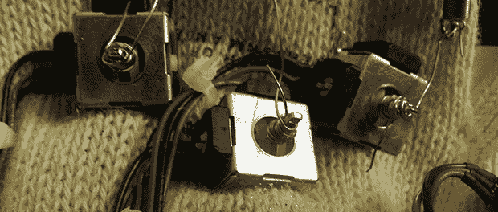

# 操纵杆罐的传感器手套

> 原文：<https://hackaday.com/2013/08/20/sensor-gloves-from-joystick-pots/>

今年夏天在 DARPA 虚拟机器人挑战赛上工作后，Heinlenesque 机器人致动器的景象充满了[Hunter]的脑海。他的实验室可以使用一种叫做电脑手套的东西，这种手套在每个手指上都使用了柔性花盆，但每只手套都要花费实验室 15，000 美元。

在一些操纵杆电位计的帮助下，[Hunter] [很快做出了一个价值 15000 美元的设备](http://www.hscott.net/projects-2/sensor-gloves/)，它可以测量用户手指弯曲的程度。pots 被绑定到一个 Arduino 中，用 analogRead()读取，而一个小的 Python 脚本为[Hunter]可以想象的任何应用程序解释数据。

[亨特]的设计有几个缺点——不像 15000 美元的版本，它不是无线的，而且它们看起来肯定没有实物那么酷。不过，DIY 版的价格只有真货的 0.2%，所以我们暂时不考虑任何明显的问题。