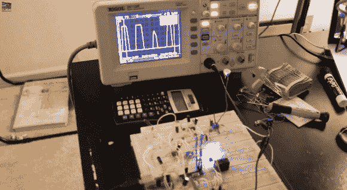

# 构建模拟哨声检测装置

> 原文：<https://hackaday.com/2013/08/20/building-an-analog-whistle-detection-device/>

Hackaday 的读者可能还记得我[limpkin]不久前设计的一个哨声检测设备。当[Kevin]看到新的员工名单时，他发现了这个项目，并想制作他的[版本](http://www.youtube.com/watch?v=hpMVG4a9sR4)。

在最初的*口哨*中，所有的信号处理都是在 ARM Cortex m4 微控制器中完成的，【Kevin】使用分立元件、运算放大器和 Arduino Uno 来检测某人的口哨。在他的视频(嵌入下面)中，他不厌其烦地解释了他的电路是如何工作的，以及背后的理论。在他的设置中，他的麦克风信号被放大，通过 1KHz-3KHz 无源带通滤波器到达增益为 1000 倍的同相放大器(！)并最终连接到电压比较器。Arduino 测量来自比较器的信号频率，如果哨声是斜升/斜降，则触发继电器。

如果你想对这两个版本的电子产品进行比较，这里有一个链接，链接到[最初吹哨的项目](http://hackaday.com/2013/05/18/just-put-your-lips-together-to-turn-on-a-lamp/)。

[https://www.youtube.com/embed/hpMVG4a9sR4?version=3&rel=1&showsearch=0&showinfo=1&iv_load_policy=1&fs=1&hl=en-US&autohide=2&wmode=transparent](https://www.youtube.com/embed/hpMVG4a9sR4?version=3&rel=1&showsearch=0&showinfo=1&iv_load_policy=1&fs=1&hl=en-US&autohide=2&wmode=transparent)