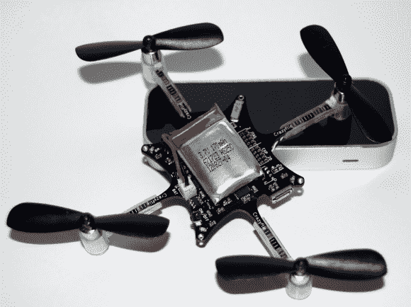

# 用 Leap 和 Kinect 控制 Crazyflie

> 原文：<https://hackaday.com/2013/08/22/crazyflie-control-with-leap-and-kinect/>

Bitcraze 的那帮人又来了，这一次他们为 Crazyflie 四轴飞行器开发了 Leap 运动控制，并发布了由 T2 Kinect 驱动的自动驾驶仪概念验证。如果你以前没有见过 Crazyflie，你可能不会意识到它有多紧凑:90 毫米电机到电机，只有 19 克。

据我们所知，Crazyflie 仍然需要一台 PC 来控制它，因此 Leap 和 Kinect 是自然的后续产品。跳跃动作的手控制是你所期望的:想象你张开的手掌像提线木偶一样控制它，手的高度决定推力。Kinect 设置看起来最有希望。这些人在 Crazyflie 上绑了一个红球，在白色背景下提供了一个可跟踪的物体。当用户通过鼠标点击转向时，Kinect 会监控四轴飞行器。独立的 PID 控制器校正滚动、俯仰和推力，将 Crazyflie 从其当前坐标重新定位到通过点击或拖动选择的新设定点。Leap 和 Kinect piloting 的视频都在下面。

手头拮据，但仍想一飞冲天？本周早些时候，我们有两个橡皮筋驱动的设备:[扑翼机](http://hackaday.com/2013/08/21/amazing-flight-of-a-3d-printed-rubber-band-powered-ornithopter/ "Amazing flight of a 3D printed rubber band powered ornithopter")和令人捧腹的 [GoPro 弹弓](http://hackaday.com/2013/08/21/gopro-slingshot/ "GoPro Slingshot")。

[https://www.youtube.com/embed/xdm1qp1BYyo?version=3&rel=1&showsearch=0&showinfo=1&iv_load_policy=1&fs=1&hl=en-US&autohide=2&wmode=transparent](https://www.youtube.com/embed/xdm1qp1BYyo?version=3&rel=1&showsearch=0&showinfo=1&iv_load_policy=1&fs=1&hl=en-US&autohide=2&wmode=transparent)

[https://www.youtube.com/embed/UzFwg2Fpv4E?version=3&rel=1&showsearch=0&showinfo=1&iv_load_policy=1&fs=1&hl=en-US&autohide=2&wmode=transparent](https://www.youtube.com/embed/UzFwg2Fpv4E?version=3&rel=1&showsearch=0&showinfo=1&iv_load_policy=1&fs=1&hl=en-US&autohide=2&wmode=transparent)