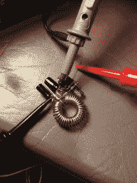
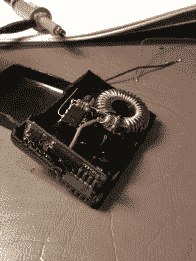
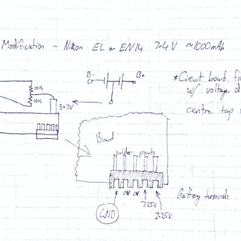
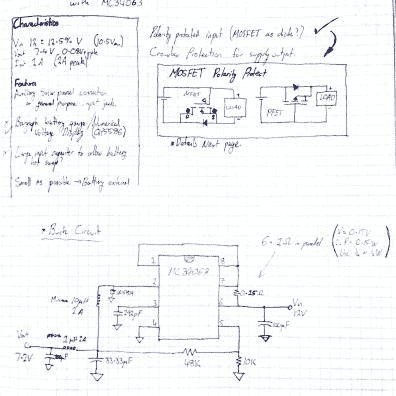

# 本周失败:开关模式 PSU 相机电池更换

> 原文：<https://hackaday.com/2013/08/22/fail-of-the-week-switched-mode-psu-camera-battery-replacement/>

我们真的希望这周的失败能成功。[迈克尔]想要为他的尼康 D3100 相机增加电量。他的想法是用降压转换器取代电池，并为外部电池添加导线。这提供了在各种电压源下运行的可能性；使用特殊电池设备的诱人前景。具体来说，他想换掉库存的 7.4V 1030 mAh 电池，改用 18 Ah 铅酸电池。

在像这样的项目中，最大的障碍是相机用来与电池通信的逻辑。出于这个原因，也为了更容易找到合适的外形，他废弃了一个旧电池组，重新使用主板和机箱。他的电源是一个自由形式的电路，非常适合分配的空间。

电路通电，但只有大约 6.4V。这不足以运行相机，这意味着这只是[迈克尔]练习焊接的一种昂贵的方式。在跳伞之后，你可以阅读他对这次经历的叙述。你还会找到一些构建图像，以及他在开发过程中使用的两张手绘示意图。他的 Dropbox 有全部的图片收藏。

        

> 黑客将一个降压转换器构建到售后电池中，并将导线从电池舱中引出，这样相机(7.4V 1030mAh)就可以从更大的外部密封铅酸单元(12V 18Ah)中运行。
> 
> 这个项目的动机是在我注意到 30 分钟的高清拍摄后真正的电池几乎耗尽后实现的。预计这种技术对于长时间延时摄影也非常有用。无论如何，值得注意的是，216Wh SLA 的价格约为 40 美元，而真正的尼康电池(9.6Wh)在易贝的价格约为 50 美元！
> 
> 即使降压转换器的效率数据不乐观，总增益也很明显，单位为 Wh/$。
> 
> 但是我跑题了。
> 
> 失败源于令人失望的电路性能。该电路未能输出计算的电压(标称 7.3V)，而是只能提供约 6.4V 的电压，这对于相机来说太低，甚至无法通电。
> 
> 我仍然不确定是什么问题；
> 
> *   误算元件值/电感不在范围内？
> *   电流消耗太高？
> *   死虫风格架构中的噪音？
> *   焊接不正确的零件？
> *   错误地识别了供体电池电路板的功能？
> *   热熔胶的导电性？(我很怀疑)
> 
> 这些照片原本是作为一个构建日志，但现在只能展示一些 neato 死虫焊接。
> 
> 无论错误是什么，我已经放弃了我尝试过的可能更优雅的方法，而是计划使用一个在易贝上可以找到的 5 美元的可变降压转换器。该装置将安装在大型外部铅蓄电池上，其输出进入空壳售后电池。作为一个预组装电路，我要做的就是正确的输入和输出极性！
> 
> 你也可以在示意图上看到。我想实现输入极性保护(两个 mosfet 电路)。这些来自一个应用笔记，我现在不记得如何找到，但我找到了一个类似的 (PDF)。这是避免普通输入二极管降低 0.7V 电压的一种好方法。

    

我们已经在寻找下周的失败帖子主题。写下你过去的失败，并[给我们发送一个故事的链接](mailto:tips@hackaday.com?Subject=[Fail of the Week])，帮助保持乐趣。