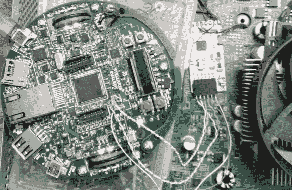

# 作为 JTAG 程序员的 Evalbot

> 原文：<https://hackaday.com/2013/08/24/evalbot-as-a-jtag-programmer/>

[Adarsh]需要一名 JTAG 程序员将代码推送到他工作的 CPLD 开发板。他知道自己没有专门的程序员，但他认为自己可以想出一些办法。上图是他使用 Stellaris Evalbot 作为程序员的方法。

长期读者会记得 2010 年 Evalbot 优惠券代码的崩溃。作为会议的一部分，这些套件以 125 美元的折扣出售。我们得到了关于代码的提示，但不知道它的限制，剩下的就是历史了。我们认为有很多读者都有一台这样的电脑(除了像亚当这样的人，T2 把它当作网络服务器使用)。这是你再次拿出来玩的机会。

只需在电路板上焊接一点测试点。连接是在 J4 足迹上进行的，这是一个无人居住的 ICDI 报头。在软件方面,[Adarsh]使用 OpenOCD 和股票配置和板文件(在他的文章中有详细说明)通过 JTAG 连接到白色的 CPLD 板。