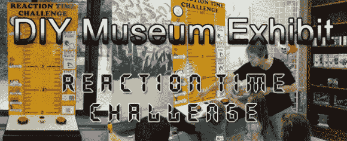

# 反应时间挑战

> 原文：<https://hackaday.com/2013/08/26/reaction-time-challenge/>

我们不知道[比尔·波特]在哪里找到他所有的空闲时间，但我们很高兴他很好地利用了这些时间，为当地的科学博物馆建造了一个展览项目:[反应时间挑战](http://www.billporter.info/2013/08/24/diy-museum-exhibit-reaction-time-challenge/)。很可能我们小时候在这样的博物馆里都被激发热爱科学，而[比尔]的贡献已经吸引了年轻的观众。这项挑战让两个参与者测试在随机产生的倒计时后，他们能以多快的速度按下一个大红色按钮。玩家做出反应的时间被转化为 RGB LED 条，测量他们按下按钮的速度。

像这样的构建需要清楚地传达应该如何使用它们；你不想让困惑的孩子在你的柜子上乱撞。首先，[Bill]将大塑料按钮内暗淡的 led 去掉，换上一些更亮的。为了保持连接的整洁，他把以太网电缆的拆下来的两端与扬声器和按钮连接到一个以太网插孔上。插孔舒适地安装在一个项目箱中，在那里它连接到一个 Arduino。两个 RGB LED 灯条从盒子的另一端伸出，以菊花链形式从机柜底部连接到顶部，然后再返回。休息后在视频中看到这一切。

[比尔的]博物馆一定很幸运；一年多前，他为他们恢复了“定格”展览，并在过去的几年里为他们做了许多其他项目。

[https://www.youtube.com/embed/A1frGc8oWGY?version=3&rel=1&showsearch=0&showinfo=1&iv_load_policy=1&fs=1&hl=en-US&autohide=2&wmode=transparent](https://www.youtube.com/embed/A1frGc8oWGY?version=3&rel=1&showsearch=0&showinfo=1&iv_load_policy=1&fs=1&hl=en-US&autohide=2&wmode=transparent)