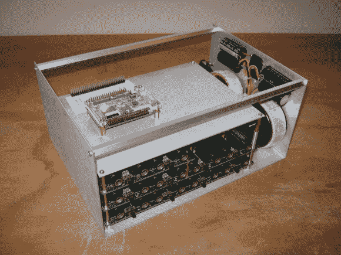

# 用废弃的木板建造一个音箱

> 原文：<https://hackaday.com/2013/08/24/building-an-audio-box-out-of-thrown-away-boards/>

上次[Mark]在废料场时，他设法找到了一台旧的 Akai DR8 studio 硬盘录像机的模拟输入和输出卡。这些卡提供了很大的可能性(8 个 ADC 输入，12 个 DAC 输出)，所以他修理了它们，[用它们制作了一个完整的音频系统](http://www.idesignz.org/AudioBox/AudioBox.htm)。

修复只涉及改变一对夫妇的低压差稳压器。后来，[Mark]连接了他的一个 CPLD 开发板，这样他就可以产生一些正弦波，并数字化从基于 PC 的音频测试单元产生的信号。然后，他制作了上图所示的框架，并改用 Altera Cyclone IV FPGA。为了完善他的系统，他设计了一个小电路板来连接 VGA 屏幕，另一个电路板使用 nRF24L01 无线模块。

在 FPGA 内部，[Mark]使用了 NIOS II 软核处理器来协调整个系统，并显示一个漂亮的用户界面。他甚至制作了另一个带有 USB 主机插头的系统来连接支持 MIDI 的外围设备，使他能够无线控制他的创作。