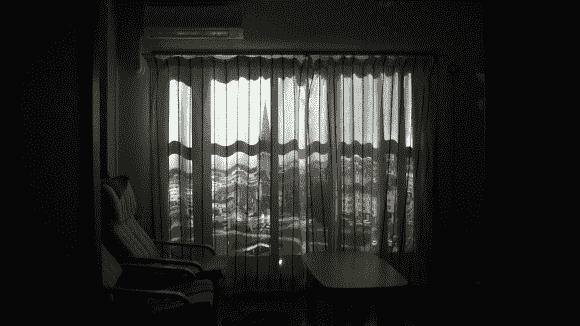

# 为你客厅窗外的景色做一次整容

> 原文：<https://hackaday.com/2013/08/27/a-facelift-for-the-view-out-your-livingroom-window/>

[Ken Kawamoto]把他客厅里的平淡无奇的景色变成了高价房地产的景色。它只在晚上工作，这看起来很奇怪，因为上面的图像显示的是白天的场景。但这仍然是一个非常美好的概念。

下面的视频显示了从他的窗口看到的实际情况。我们并不认为这有多糟糕(我们曾经住在一层公寓里，面对着停车场……恶心！).但是上面看到的法国卡昂圣蒂安修道院的景色要好得多。他干脆在自家阳台上放了个投影仪，拉上了浅色的百叶窗。到目前为止，他每次使用后都要把它带进来，但我们认为这只是在娱乐时才使用。

这些年来，我们已经看到了一些其他试图黑掉你的观点的尝试。这里有一个[用液晶屏](http://hackaday.com/2010/04/16/virtual-windows-that-track-a-viewers-position/)加假窗口。让这个系统工作的是系统跟踪观众并相应改变视角的能力。

[https://www.youtube.com/embed/zjzUnrv4sfQ?version=3&rel=1&showsearch=0&showinfo=1&iv_load_policy=1&fs=1&hl=en-US&autohide=2&wmode=transparent](https://www.youtube.com/embed/zjzUnrv4sfQ?version=3&rel=1&showsearch=0&showinfo=1&iv_load_policy=1&fs=1&hl=en-US&autohide=2&wmode=transparent)