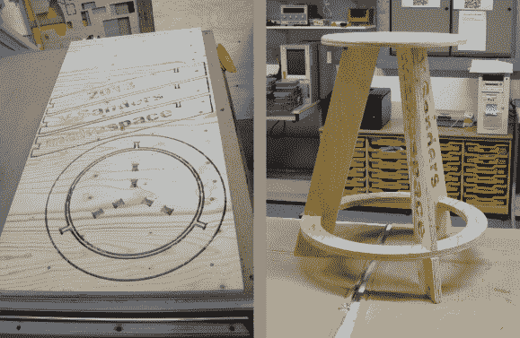

# 不需要胶水的胶合板凳的多次迭代

> 原文：<https://hackaday.com/2013/08/29/many-iterations-of-a-plywood-stool-that-requires-no-glue/>

在他当地的黑客空间[文森特·桑德斯]注意到一个有趣的问题。大多数情况下，他们的凳子都很棒，但是有一个工作台的高度非常不适合他们。因此，他开始寻求设计和制造胶合板凳，这种凳的接合处不使用胶水。

剑桥创客空间(在英国)被证明是这类项目的完美环境。他们已经有了一台可以切割胶合板的数控刳刨机，还有其他成员愿意帮助培训[文森特]使用该设备。他在 Thingiverse 上找到了一个符合要求的设计，除了实际的尺寸。他需要公制单位来匹配他可用的纸张。皈依之后，他组装了一个根本无法使用的凳子。胶合板的厚度与接缝的公差不匹配。手里拿着数字卡尺，他逛遍了镇上的不同供应商，得出了一个实际厚度范围，并相应地调整了他的接头设计。

当然，这不是最后一次修订。即使关节工作正常，座位还是有点不稳。他转向提供的下一个胶合板厚度，重新设计文件以匹配。他的最终凳子非常好用，五六个凳子可以放在一张标准的胶合板上。