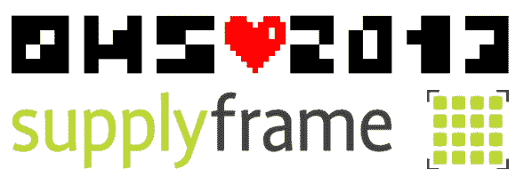

# 下周开放硬件峰会上的免费 Hackaday 资料

> 原文：<https://hackaday.com/2013/08/30/free-hackaday-stuff-at-next-weeks-open-hardware-summit/>

如果你要去参加下周的开放硬件峰会，我们为你准备了一些免费赠品。稍加注意的读者都知道 [Hackaday 在今年夏天被 Supply Frame](http://hackaday.com/2013/07/25/hello-from-supplyframe/) 收购。对于这一切意味着什么，评论中有些紧张。但是我想你会同意这是一个好的迹象，Supply Frame 是[在‘狂热’水平上的活动的主要赞助商之一。](http://2013.oshwa.org/sponsors/)

几个供应框架的家伙将出席(这让我很嫉妒，因为我太想要一个电子制表工卡了！).细节还没有完全确定，但我们相信会有一个供应框架摊位，你可以停下来，聊天，看看他们是否有任何 Hackaday T 恤留下来分发。我不认为他们会用完贴纸，所以你不会空手而归。

也可以向他们索要他们正在开发的非常秘密的新在线工具的测试代码。上周参观他们在帕萨迪纳的总部时，我得到了一个预览。它简化了设计的规划和器件选择过程，会受到电子工程师和爱好电子产品的爱好者的欢迎。事实上，现在我想起来了，它解决了一个我以前在 Amp hour 上听达夫·琼斯抱怨过的问题。很明显，在他们完全上线之前，我有点信息封锁，但我相信一旦他们上线，我们会报道的。顺便说一句，这个项目的开发人员之一——[Ben de larre]——创建了 [CircuitBee](http://www.circuitbee.com/) 。

我们自己的埃里克·埃文奇克也将到场。他仍在为未来的就业建立关系网，所以你可能不会发现他只是坐在旧金山的展位上。他还会分发黑客贴纸，因为我对没有和他一起送纪念品给 Def Con 感到很抱歉。事情结束后，寻找他对这件事的回忆。

如果你不能去 OHS 也不用担心。[Brian Benchoff]计划在九月晚些时候去参加世界创客大会，他也会带一些免费赠品！