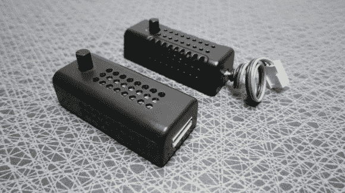

# 冷却风扇速度控制器通过产生热量来实现

> 原文：<https://hackaday.com/2013/08/30/cooling-fan-speed-controllers-do-it-by-generating-heat/>

我们自己从来没有拆开过，但是当我们得知这些冷却风扇控制器产生热量来完成它们的工作时，我们还是有点困惑。我们敢打赌，我们会在评论中被淹没，但这难道不会适得其反吗？

无论如何，我们喜欢阅读关于这个话题的两个帖子。[戈兰的]第一次硬件冒险始于他试图设计自己的速度控制器。他在 LM7805 线性调节器数据手册中看到一个参考设计，允许通过改变接地基准来调整输出。当以 12V 供电时，这最终会释放一些热量，但这是一个简单而可靠的解决方案。他有点惊讶地打开一个扎尔曼模块，发现里面有完全相同的电路。

背景中的控制器是易贝购买的。他也打开了那个(这是顶部的链接)，发现了一个带线性调节器的电路，但这次是 TL431 可调调节器。所以我们的问题是:这两者哪一个更好，为什么。你能在不产生这么多热量的情况下相对便宜地做到吗？