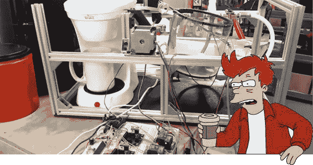

# 机器人咖啡机的第一阶段

> 原文：<https://hackaday.com/2013/09/02/phase-one-of-a-robot-coffee-maker/>

一台煮一壶新鲜咖啡的咖啡机，自动将咖啡放入过滤器，向咖啡机注水，冲泡，倾倒咖啡渣，添加糖和奶油，所有这些都无需任何人工干预。有人可能称之为疯子的狂热梦想。其他人可能称之为自动售货机。我们所知道的是[【菲尔】正在开发他自己版本的这个卓越的机器人](http://www.youtube.com/watch?v=jxVTTHgNkEk)。

这只是机器人咖啡机制造的第一阶段，但到目前为止[Phil]已经有了一个单杯咖啡机，它可以自动装满水并倾倒咖啡渣。

电子设备基于 PIC18F4550，它控制两个控制电磁阀的机械继电器，一个控制咖啡机电源的固态继电器，以及两个打开咖啡机盖子并将过滤器倒入清洗箱的步进电机驱动器。

这是一个令人敬畏的构建，我们期待着这个令人敬畏的，真正的自制构建的下一个阶段。