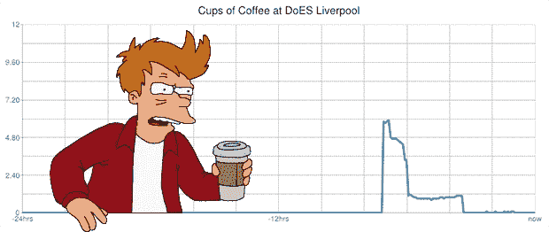

# 用 Arduino 监控咖啡壶

> 原文：<https://hackaday.com/2013/09/02/monitoring-a-coffee-pot-with-an-arduino/>

咖啡一直是互联网的重要组成部分；第一个网络摄像头是在剑桥大学计算机实验室的特洛伊房间里，用来监控咖啡壶里的东西。现在，我们有了 Arduinos 和浴室秤，而不是网络摄像头。与网络摄像头并不特别相似，但足以记录利物浦目前有多少咖啡。

作为一个技术工作室，利物浦的咖啡总是供不应求。[Patrick]认为在线监控咖啡壶的内容是一个好主意，而不是起来检查咖啡壶。他正在用咖啡机下面的浴室秤做这项工作，咖啡机连接到 Arduino 以太网模块。通过测量咖啡壶的重量并减去已知的空重量，[Patrick]可以很好地了解壶中还剩多少咖啡，以及咖啡在那里放了多长时间。

来自 Arduino 的数据被传送到一个 Xively feed，该 feed 在任何一台有互联网连接的计算机上显示咖啡机的当前状态。比有史以来第一个网络摄像头更复杂，是利物浦 DoES 每个人的一个非常有用的工具。