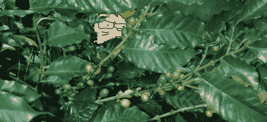

# 种植自己的咖啡豆

> 原文：<https://hackaday.com/2013/09/02/grow-your-own-coffee-beans/>

不像 t 恤、运动鞋、手机、儿童玩具、软件、电器，几乎所有由塑料制成的东西和食物，人们似乎真的很关心谁煮的咖啡。与其购买 ~~[无罪恶感](http://www.youtube.com/watch?v=yzcfsq1_bt8)~~ 自由贸易咖啡，Instructables 上的【斯派克】决定实际做点什么来根除消费主义的邪恶。他在家里用一棵真正的咖啡树自制咖啡。

几年前在易贝买了一个咖啡工厂。咖啡树实际上是树，通过精心修剪，它们可以保持在一个合理的大小。但是天气呢？嗯，对于住在美国农业部 7a 耐寒区(从新泽西州南部到德克萨斯州狭长地带)的[斯皮克]来说，他只是在天冷的时候把植物带进来。

一旦咖啡果实成熟，[斯皮克]采摘咖啡豆，剥去果实外壳，然后将咖啡豆放入脱水机中。从那里开始，经过一个小型咖啡烘焙室，进入一家法国出版社。

只收获了大约半磅的豆子。对于在一千英里之外的原产地种植一棵盆景咖啡树来说，这仍然令人印象深刻。