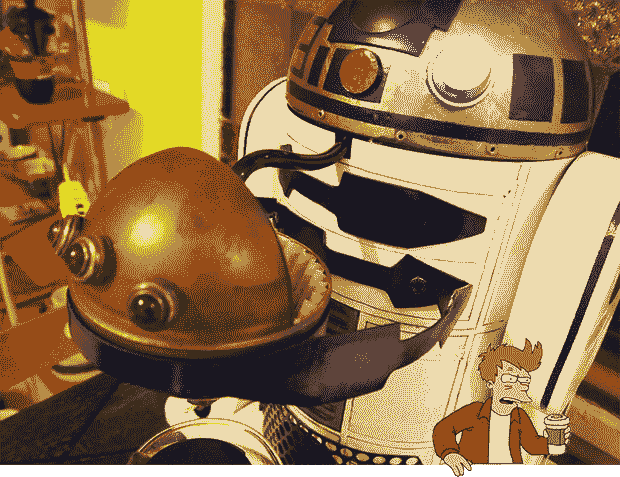

# 把自己交给黑暗的烤面

> 原文：<https://hackaday.com/2013/09/02/give-yourself-to-the-dark-roast-side/>

一个普通的咖啡机不适合晚餐聚会或者任何你急需大量咖啡的时候。在这一点上，你有两个选择:你可以买一个工业咖啡机，或者你可以[买一个工业咖啡机，让它看起来像 R2D2](http://www.instructables.com/id/R2D2-Dark-Roast-Edition/) 。猜猜我们认为哪个选项更酷？

R2D2 咖啡壶是为大型晚宴设计的，在那里等五分钟煮一壶咖啡是浪费时间。R2 的身体不是“咖啡先生”，而是一台工业用的 BUNN 咖啡机。这个咖啡机有两个水箱，一个注入咖啡过滤器，另一个保持一壶咖啡的热水。

至于对咖啡壶的修饰，[imithebathroom]在一个垃圾场为 R2 的头部找到了一个奇妙的圆顶。它以前是一个巨大的球阀，用锯子稍微加工一下，就把它切割成合适的 R2 头骨形状。R2 的声音——在下面的视频中可以听到——来自一张贺卡，上面写着《星球大战》传奇中真正英雄的声音。

[https://www.youtube.com/embed/R4YfltE83-I?version=3&rel=1&showsearch=0&showinfo=1&iv_load_policy=1&fs=1&hl=en-US&autohide=2&wmode=transparent](https://www.youtube.com/embed/R4YfltE83-I?version=3&rel=1&showsearch=0&showinfo=1&iv_load_policy=1&fs=1&hl=en-US&autohide=2&wmode=transparent)