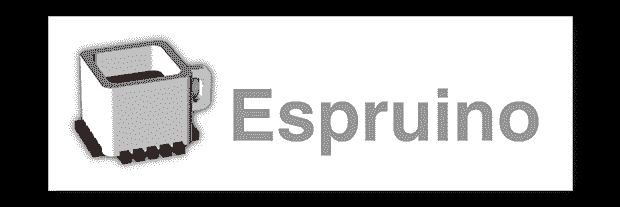

# 事物的 JavaScript

> 原文：<https://hackaday.com/2013/09/03/the-javascript-of-things/>

有很多人可以用 JavaScript 编程，但是如果给他们一个嵌入式设备，他们就会陷入困境。不再是了，这要感谢[Gordon]精彩的 [Espruino](http://www.espruino.com/) ，一个 ARM 微控制器的 JavaScript 解释器。哦，它也是一个非常有能力的开发板，有足够的能力将你能想象的任何项目变成现实。

Espruino 板上有一个 ARM Cortex M3，其形式为 STM32 芯片、256kB 闪存、48kB RAM、大量 PWM 和 ADC 引脚，以及 2 个 SPI 端口、2 个 I2C 端口和 2 个 DAC。这是一款非常强大的硬件，如果你想构建任何东西，很难找到更好的通用开发板。

[Gordon]已经把他的板放到了 Kickstarter 上，由于已经成功获得了资金，他将在开源许可下发布硬件和软件源代码。如果你曾经想在 ARM 板上运行 JavaScript，看起来 Espruino 正是你想要的。