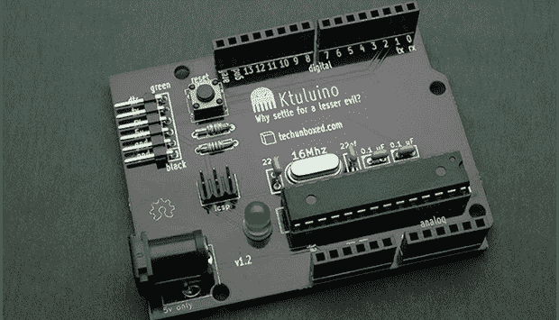

# 这个世界最不需要的就是另一个 Arduino 克隆体

> 原文：<https://hackaday.com/2013/09/03/another-arduino-clone-is-the-last-thing-the-world-needs/>

有人可能会认为这个世界最不需要的就是那些伟大的老人从太平洋深处接近死亡的睡眠中醒来，重新开始他们对地球的统治。事实上，这个世界最不需要的就是另一个 Arduino 克隆体。这里有一个。准确地说，它叫做克图鲁伊诺。

实际上，这并不是另一次试图构建一个没有给现有设计增加任何东西的阿尔杜伊诺克隆体；这只是[杰夫]在 PCB 设计方面的尝试。他需要一些东西来练习，所以为什么不以-uino 结尾呢？

该板就像 Arduinos 一样简单 ATMega328P 是这套设备的大脑，也是最昂贵的组件，紧随其后的是电源插孔或插头引脚。作为 PCB 设计的一个练习，我们会给它一个大拇指，但它也可以用于 hackerspace 的“焊接介绍”研讨会，或者杯垫。