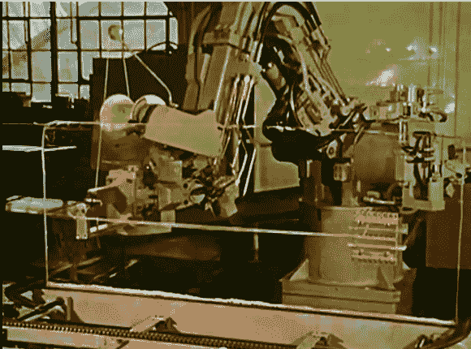

# 逆向技术:6CH 工业机器人

> 原文：<https://hackaday.com/2013/09/03/retrotechtacular-6ch-industrial-robot/>

有了这个 1975 年的机械臂演示视频，未来就在眼前。想想看，有很多工厂都是这种技术的后代，在那里，人类工人只是简单地喂养野兽，并在它坏掉时修理它。

我们对下面展示的内容印象深刻。不是因为我们看到了我们以前不知道的可能，而是因为近四十年前的技术如此先进。这里，机械臂正在夹具上布置线束。我们想知道，当他们添加连接器时，使用单一颜色的电线是否会成为一大难题？

很明显，机械是坚固的。时间带来了精度的进一步提高，降低了成本，使机器人甚至可以用于小型工厂(通常产品的码垛是由[一台类似于](http://en.wikipedia.org/wiki/Palletizer)的机器完成的)，以及任务编程方式的改进。毕竟，打印程序的硬拷贝作为穿孔带的能力在这十年里并不十分先进。

这对你来说意味着什么？如果你足够努力地寻找，你可能会找到一个老一代的机器人手臂来攻击 T1。

[https://www.youtube.com/embed/wLJLDIMNjzA?version=3&rel=1&showsearch=0&showinfo=1&iv_load_policy=1&fs=1&hl=en-US&autohide=2&wmode=transparent](https://www.youtube.com/embed/wLJLDIMNjzA?version=3&rel=1&showsearch=0&showinfo=1&iv_load_policy=1&fs=1&hl=en-US&autohide=2&wmode=transparent)

[感谢 Amos via [EE Times](http://www.eetimes.com/document.asp?doc_id=1319355&)

Retrotechtacular 是一个每周专栏，以旧时的黑客、技术和媚俗为特色。通过[发送您对未来分期付款的想法](mailto:tips@hackaday.com?Subject=[Retrotechtacular])，帮助保持新鲜感。