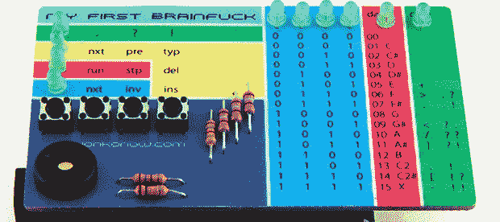

# 我的第一个想法

> 原文：<https://hackaday.com/2013/09/06/my-first-brainfck/>

曾几何时——就在不久前——我的第一台电脑需要使用机器代码并理解二进制代码。虽然现在对计算机的介绍只是如何将 Raspberry Pi 图像放在 SD 卡上，但一些人仍然保持着记忆操作码的梦想。其中一个人就是约翰·冯·科诺，他是我的第一个脑残电脑 T1 的创造者，这是一台超小型、低成本的可编程计算机。

我的第一个脑残是一个 Arduino shield，它被设计成具有普通计算机的所有功能，但没有那些使汇编编程如此容易的混乱的助记符。这台电脑是用 [Brainfuck](http://en.wikipedia.org/wiki/Brainfuck) 编程的，这是一种故意设计的迟钝的编程语言，虽然难以置信地深奥和难以编程，但却非常非常有益。

[Johan] [有一个简短的教程](http://vonkonow.com/wordpress/2013/09/master-my-first-brainfuck/)展示他的计算机如何工作，以及 Brainfuck 语言如何操作。Brainfuck 中只有八个命令，对于这样一个最小的用户界面来说是完美的，但是只要有足够的耐心，几乎任何东西都可以用这种困难的语言编写。

现在有几个例子显示如何在板上蜂鸣器上演奏音阶，在 led 上显示 Larson 扫描仪，将来还会有更多的程序发布。