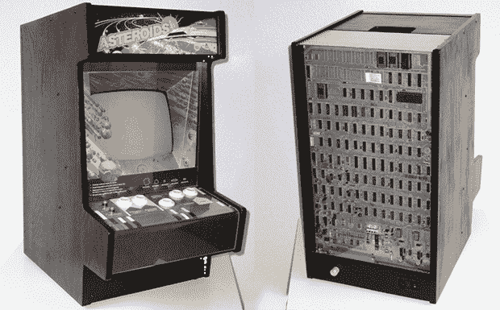

# 让小行星变小

> 原文：<https://hackaday.com/2013/09/05/making-asteroids-miniature/>

迷你街机柜建造相当常见，但我们从未见过像[Jurgen]的[迷你矢量小行星柜](http://www.e-basteln.de/asteroids/asteroids_intro.html)这样的东西，它采用原始的小行星电路板和真正的矢量显示器，并将其缩小到桌面大小。

与下一代街机游戏的光栅显示器不同，最初的小行星机柜使用的是矢量显示器，就像示波器中的显示器一样。[Jurgen]在一个坏掉的 Vectrex 控制台中找到了完美的 CRT。Vectrex 中的视频电路相当原始，光束偏转对于小行星 PCB 产生的视频信号来说太慢了。为了解决这个问题，[Jurgen]添加了一个定制的 XY 驱动板。虽然小行星游戏和其他矢量雅达利游戏是为 1 MHz 带宽的屏幕设计的，但[Jurgen]发现 300 kHz“足够好”来显示适当的小行星图形。

虽然这个柜子不是任何合适柜子的缩小版，但[尤尔根]确实为他的便携版小行星做了一个相当好看的箱子。背面裸露的 PCB 是一个很好的接触，对于任何古代视频游戏爱好者来说都是一个可怕的项目。