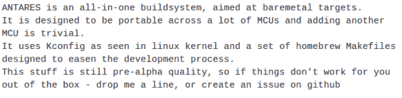

# Antares:统治所有微控制器的裸机构建系统

> 原文：<https://hackaday.com/2013/09/06/antares-one-bare-metal-build-system-to-rule-all-micocontrollers/>

[Andrew Andrianov]在谈到各种廉价的开发板时，与我们有着同样的渴望。他们将硬件放在您的手中，但是当涉及到 IDE 时，它往往是一个非常混杂的包。有些提供专有软件的不完整副本，但是在大多数情况下，您需要依靠自己来获得任何种类的开源开发环境支持。他和几个朋友正在努力改变这种状况。他们想出的是 [Antares:一个可以为多个微控制器编译代码的单一构建系统](https://github.com/nekromant/antares)。

想法是使编码环境与编译/烧录过程无关。这有几个目的:它允许您使用您最熟悉的 IDE，无论是 Eclipse 还是 emacs。它还试图减轻编写能在多种不同芯片上工作的库的痛苦。到目前为止，该软件包支持几个常见的嫌疑人:AVR，msp430，STM32 ARM 芯片，以及 AT89 和 8051 的 STC 变体。随着人多力量大，可以添加其他芯片(换句话说，卷起你的袖子，帮助这些家伙！).现在开发的目标是 Linux 开发平台，但是 OS X 已经被证明可以使用一些补丁。

上面的链接是来自 Github repo 的一个令人望而生畏的自述文件。如果你在开始之前需要一个更好的概述，请点击[Andrew's]博客上的[RC1 公告](http://ncrmnt.org/wp/2013/09/05/antares-0-2-rc1-released/)。