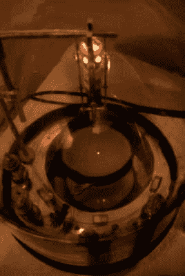

# 3D 打印:关键专利

> 原文：<https://hackaday.com/2013/09/11/3d-printering-key-patents/>

这里有一个关于科技博客和一般新闻的小提示:你读到的一切绝对是百分之百真实的，除非你——读者——知道任何关于正在讨论的故事的事情。在 Wired 和 CNet 上的商店，使用 ARM Cortex-M3 的设备被描述为具有“与现代智能手机相同的 CPU”完全合法，除非你知道在这样的芯片上运行 Android 几乎是不可能的。

“关键 3D 打印专利将于 2014 年到期”就是如此——一句话[关于](http://www.tested.com/tech/3d-printing/456856-laser-sintering-3d-printing-patents-expiring-2014/) [科技博客](http://www.smh.com.au/digital-life/digital-life-news/lets-curb-our-3dprinter-enthusiasm-20130816-2s18p.html) [新闻](http://mashable.com/2013/09/05/3d-printing-healthcare/) [第七封](http://www.formtek.com/blog/?p=3979) [已被](http://tech.fortune.cnn.com/2013/09/03/3d-printing/) [打破](http://techonomy.com/2013/07/watch-for-key-3d-printing-patents-to-expire/)。如果你相信你在网上读到的一切，我们将在短短几个月内看到一个 3D 打印棒棒糖、独角兽和彩虹的世界。按照上述新闻真实性的逻辑，情况显然不是这样。那么，这些专利的到期实际上意味着什么呢？

#### 让我们后退一点

目前的 3D 打印机使用熔融沉积建模，FDM，或“喷射熔化塑料”的方法。这项技术[于 1989 年](https://www.google.com/patents/US5121329)由 3D 打印机最大制造商之一 Stratasys 的联合创始人【Scott Crump】申请专利。这项专利于 2009 年到期，并非巧合的是，3D 打印真正开始兴起是在那个时候，[Reprap Mendel](http://en.wikipedia.org/wiki/RepRap_Project)的开发，以及之前开放硬件社区的金童 [Makerbot](http://en.wikipedia.org/wiki/MakerBot_Industries) 的创立。

如果过去的结果可以预示未来的表现，这些关键的 3D 打印专利的到期将导致一次性制造、快速原型制作和一些真正酷的项目在未来一两年内出现在 hackerspaces 领域的又一次繁荣。

#### 这是专利

散布在互联网上的数百篇文章所引用的“[关键专利](https://www.google.com/patents/US5597589)”(如果你想了解更多，只需搜索[【卡尔·r·德克德】](https://www.google.com/search?tbo=p&tbm=pts&hl=en&q=ininventor:%22Carl+R.+Deckard%22))涉及选择性激光烧结。你会问，什么是 SLS？[其实很简单](http://en.wikipedia.org/wiki/Selective_laser_sintering):取一些粉末，用激光照射，让粉末融化，然后在你刚刚创造的混乱上撒上一层新的粉末。与我们今天使用的 FDM reprap 和 Makerbots 相比，SLS 可以使用多种塑料；你甚至可以用金属打印，让自己成为火箭发动机。如果美国国家航空航天局正在做，它必须是令人敬畏的，对不对？

#### 那么是什么让 SLS 如此伟大呢？

尽管目前的“喷射塑料”打印机阵容相当强大，在合适的人手里可以做很多事情，但有些事情是 RepRap 或 Makerbot 等 FDM 机器做不到的。悬垂是可能的，但是对于非常复杂的形状——一英尺高的埃菲尔铁塔模型——你看到的是一个充满伤害的世界。FDM 机器能打印出这种东西的唯一方法是用两根细丝，使用一种材料作为支撑，然后将其溶解掉。

同样的道理也适用于零件内部的印刷，比如广受欢迎的“笼子里的球”雕刻项目。没有支架，没有喷射塑料 3D 打印机可以做到这一点，但 SLS 机器使它变得非常非常容易。

SLS 也允许许多许多不同的材料。虽然大多数 FDM 机器除了 ABS 和 PLA 看不到细丝，但是激光烧结机器可以打印任何熔化的粉末。从尼龙到聚碳酸酯再到金属，一切都可以通过激光烧结实现。

最后。激光比最常见的 3D 打印机精度高得多。虽然非常精确的 FDM 机器可以打印出相当于一根头发的精度，但这并不是大多数 RepRappers 的情况。SLS 根本没有家庭打印机常见的渗色和错位问题。

#### 为什么你的车库里没有 SLS 打印机

这些打印机将一切都简化了很多，基本上由两部分组成:顶部的激光切割机，以及下面一层一层构建零件的活塞和滚轮系统。很简单，对吧？让我们做一些粗略的计算，看看制造我们自己的 SLS 打印机要花多少钱。

重要的事情先来。我们需要能在 XY 平面上移动激光束的东西。这里有一个神奇的开源激光切割机可以做到这一点。BOM 列出的组件成本(减去激光管)约为 850 美元。外加一个来自中国的易贝二氧化碳激光管，你看到的是一个功能齐全的激光切割机，价格大约为 1100 美元。这太棒了，尽管它与你通过普通渠道以同样的价格买到的便宜、容量更小的中国制造的激光切割机差不多。

那是我们一半的建筑。现在我们所需要的是某种分配粉末的滚筒和一个一层一层建造零件的活塞机构。这就是事情变得有点困难的地方。你可能需要某种金属薄板制造罐来装所有的粉末，活塞需要在相当紧的公差范围内工作。滚筒很简单，但你也需要一些方法来(在某种程度上)均匀地将粉末撒在滚筒前面。最后，你可能会看到 2000-3000 美元左右的低端家用 SLS 打印机。

The electron gun of the MetallicaRap project

然而，问题是:我们处在 Makerbot 或 Ultimaker 的价位附近——两者都是经过验证的机器——而 SLS 机器不会好到哪里去。你仍然基本上只处理塑料，虽然你不必处理我们的 DIY 激光 3D 打印机上的支撑结构，但你没有做任何用立体平版印刷打印机无法完成的事情，如价格相同的树脂基 [Form 1 打印机](http://hackaday.com/2012/10/01/running-into-the-form-1-printer-at-maker-faire/)。
至于金属印刷，对任何比汽车便宜的机器来说都是白日做梦。用激光烧结金属需要一个真空室、扩散泵和一些非常坚硬的核心设备才能正确完成。更不用说你不能用 40 瓦的激光熔化任何数量可观的金属。虽然一个名为 [MetallicaRap](http://reprap.org/wiki/MetalicaRap) 的类似项目取得了一些进展，但 MetallicaRap 团队估计他们的最终套件将花费大约€1 万英镑，超出了几乎每个业余爱好者或黑客空间的范围。

顺便说一下，MetallicaRap 项目真的很棒，你应该[考虑给这个项目捐一点小款](http://reprap.org/wiki/MetalicaRap#Crowd_Funding_Support_of_MetalicaRap)。

基本上，如果你不知道如何在地下室建造电子显微镜或聚变反应堆，你就不具备设计一台可以打印可用金属部件的机器的技能。

#### 如果不是自制，那是什么？

每个人都对“关键专利”的到期如此兴奋的原因是，除了 3D 系统公司之外的其他大公司——例如 Stratasys 和 z corp——将能够制造自己的 SLS 打印机。这很好，但即使是 3D 系统，这些 SLS 打印机的制造商也只在专业范围内使用它们。这些公司生产的大部分专业打印机使用类似于 SLS 的方法——使用喷墨将粘合剂喷到粉末上——但这不在 SLS 专利的范围内。

如果有的话，这些关键专利的到期将意味着非常非常高端打印机的成本下降。NASA 用的东西。当然，一些大公司会将这项技术用于定制的一次性零件，但不要指望在短期内看到任何激光烧结零件出现在你汽车的发动机上。请记住，3D 打印和快速制造只有在你需要制造少量零件时才是理想的。再多一点，用传统的制造方法会更好。

#### 最后…

2014 年关键 3D 打印专利的到期会改变 3D 打印领域的任何事情吗？好吧，大型的，已经建立的 3D 打印机制造商将会推出更便宜的可以打印金属的打印机。你将可以花几百美元而不是几千美元购买一个 3D 打印的火箭引擎。一旦 Shapeways 得到其中一台机器，你可能会看到一些由业余爱好者制造的[极小的内燃机](http://hackaday.com/2013/06/09/1200-hours-of-work-results-in-the-smallest-v12-engine/)。Kickstarter 上可能会出现大量 3D 打印机/激光切割机的组合。除此之外呢？这将会很酷，但是专利到期不会在一夜之间改变世界。