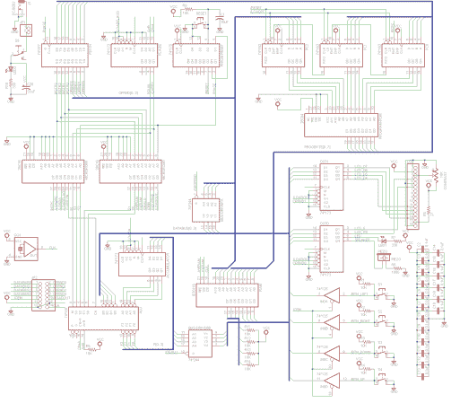

# 尼卜乐:用 7400 逻辑构建的 4 位 CPU

> 原文：<https://hackaday.com/2013/09/08/the-nibbler-a-4-bit-cpu-built-with-7400-logic/>

也许我们不应该说“建成”，因为(史蒂夫·钱伯林)还没有真正加热他的铁。从上面完成的示意图，这是令人费解的，直到你认识到项目的范围。他的[尼卜乐使用 7400 逻辑芯片实现了一个 4 位 CPU](http://www.bigmessowires.com/category/nibbler/) 。因为架构是他自己想出来的，所以在提交 PCB 之前，他采取了很多步骤来检查他的所有工作。

我们链接到他的项目仍在进行中的类别。最近他写了一个程序来证明它可以在硬件上运行。考虑到这仍然只是一个设计想法，这是一个壮举。这之所以成为可能，是因为他根据这个设计编写了一个模拟器。C++工具模拟数据和控制总线，具有全套调试工具。

在构建之前仔细测试设计是最好的方法。模拟器和调试工具对于软件开发是有用的，即使是在硬件建成之后。布线前的测试是必须的，因为就焊接复杂性而言，这些事情很快就会失控。

[via [危险原型](http://dangerousprototypes.com/2013/08/28/nibbler-another-7400-4-bit-custom-cpu/)