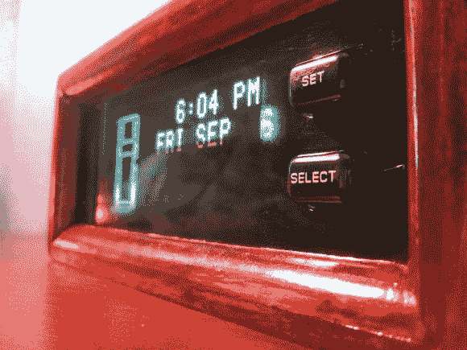

# 吉普车仪表盘上的显示屏变成了座钟

> 原文：<https://hackaday.com/2013/09/09/jeep-dashboard-display-turned-into-a-desk-clock/>

通过左侧的按钮和车辆轮廓可以很容易地识别该显示。是吉普大切诺基的车辆信息中心。[Florlayamp]在一个垃圾场发现了一排车辆，所有车辆的显示屏都完好无损。他抓起一个，把受害者变成了一个台钟。你愿意花多少钱买这么好的二手电子硬件？六块钱怎么样？耶！

让它运行起来再简单不过了。这一切都被设定好了，可以自行运行。稍微搜索了一下，找到了一张示意图，以确定哪些电线是电源。它花了一些时间来弄清楚，但这是关于 2A 的事情，所以找到一个有价值的壁疣是必须的。

现在他确信它会起作用,[Florlayamp]开始了案例构建。这是用四分之一圆的白杨树来框住展示。在背面，你会发现一个单一的翘板开关。

通常我们看到的是相反的情况，[将显示器添加到仪表板上](http://hackaday.com/2012/09/18/giving-the-ipod-nano-a-home-on-a-honda-dashboard/)而不是回收它们。