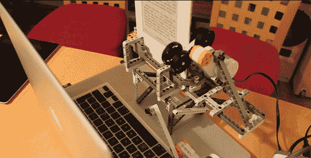

# 用乐高剥离 Kindle DRM

> 原文：<https://hackaday.com/2013/09/09/stripping-kindle-drm-with-lego/>

想象一本书放在书架上。你可以把它借给朋友，你不需要特殊的设备来阅读它，如果你愿意，你可以复印它。对于 Kindle 电子书来说就不是这样了，它通过 DRM 对你能做的事情进行了严格的限制。虽然在你的电脑上用几个程序就可以破解电子书 DRM，但是[Peter]想出了一个简单的方法，这是一个业余工程奇迹。他正在用乐高将 Kindle 电子书转换成纯文本。

[Peter]正在用乐高 NTX 系统的一些部件按下 Kindle 上的“下一页”按钮，然后在 Mac 上按空格键拍照。这些图片然后被发送到基于云的文本识别服务。听了几个小时塑料齿轮的摩擦声后，[Peter]在他的电脑里有了一份纯文本格式的电子书。

虽然看起来不切实际，但使用机器人、相机和 OCR 实际上是将受 DRM 困扰的电子书转换成文本文件的非常非常好的方法。即使亚马逊更新了他们的 DRM，使当前的软件破解方法被打破，[彼得]也会一直让他的乐高机器人准备好一次扫描几百页的文本。

[https://player.vimeo.com/video/73675285](https://player.vimeo.com/video/73675285)