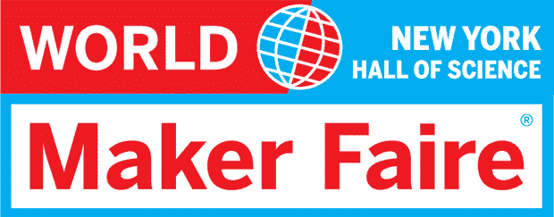

# Hackaday 要去纽约创客节了！

> 原文：<https://hackaday.com/2013/09/16/hackaday-is-going-to-the-nyc-maker-faire/>

在短短的几天内，来自世界各地的最伟大的黑客和制造者将会来到纽约市的科学大厅展示他们的产品。我们的新人(Adam)和我也将在那里，给这些制造商我们无止境的支持，张贴一些关于他们所建造的东西的帖子，并分发一些 Hackaday swag。

你可能还记得去年 Hackaday 因为红牛创作大赛而免费参加了 Maker Faire。我们张贴了许多帖子，并试图制作所有这些伟大项目的一些视频。我认为这些努力是成功的，但是视频几乎听不到，这要感谢 Maker Faire 是多么的大声(是的，我们有一个很好的猎枪麦克风)。这一次，我们将放弃视频，采用更传统的格式。预计 9 月 21 日&黑客日会有大量创客大会帖子。

如果你要去纽约创客节，看到有人穿着 Hackaday T 恤，打个招呼，我们会发一些贴纸。如果你真的很酷(我们还没有用完)，我们会附赠一件 t 恤。

因为那个周末我会在纽约市附近，所以也有可能为三州地区的 makerlabs 做几个 [Hackerspace 之旅](http://hackaday.com/2013/04/02/hackerspace-tour-arch-reactor-in-st-louis-missouri/)。如果你是纽约市某个地方的黑客空间的一员，[给我发电子邮件](mailto:brianbenchoff@hackaday.com)，我会想出如何让它工作。任何邀请我参加《T4》绝命毒师派对的人都会得到加分，