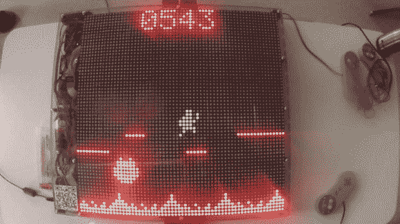

# 光的游戏

> 原文：<https://hackaday.com/2013/09/11/game-of-light/>

超逼真的图形可能是游戏的标准，但[光之游戏](https://www.youtube.com/watch?v=gpcbyfRt6WU)(警告:大声的视频音量)是一种受欢迎的通往生动、低分辨率乐趣的迂回。由[abdimalik]、[Martin]、[Andre]、[Eivind]和[Stian]为奥斯陆大学的一门课程开发的“光之游戏”有几个游戏选项，其中一些允许多达四个玩家。该建筑使用八块 DE-DP14211 LED 点阵板，每块点阵板上有 32×16 个双色 LED 和一个内置的 HT1632C 显示控制器来处理多路复用。它们安装在一起形成 64×64 分辨率的显示器。

这个盒子是由我们怀疑是丙烯酸树脂定制的，并使用一些 3D 打印件从底部偏移顶部，并将组件固定到位。SNES 控制器向 Arduino 发送数据，Arduino 也运行游戏并向显示控制器提供数据。组合中埋有两个风扇，以保持组件冷却。一切都是开源的，所以赶快去 [Github 找源代码和游戏](https://github.com/GameOfLight/Source)。

对于另一个具有很大游戏潜力的 LED 矩阵项目，请查看[Brad 的] [PS2 鼠标界面](http://hackaday.com/2013/07/15/fun-with-led-matrix-and-mouse/)，让他可以实时交互绘图。

[https://www.youtube.com/embed/gpcbyfRt6WU?version=3&rel=1&showsearch=0&showinfo=1&iv_load_policy=1&fs=1&hl=en-US&autohide=2&wmode=transparent](https://www.youtube.com/embed/gpcbyfRt6WU?version=3&rel=1&showsearch=0&showinfo=1&iv_load_policy=1&fs=1&hl=en-US&autohide=2&wmode=transparent)

【通过[布拉德的项目](http://www.bradsprojects.com/the-game-of-light/)和[努达泰克](http://www.nudatech.com/blog/20-arduino-projects-of-2013/)