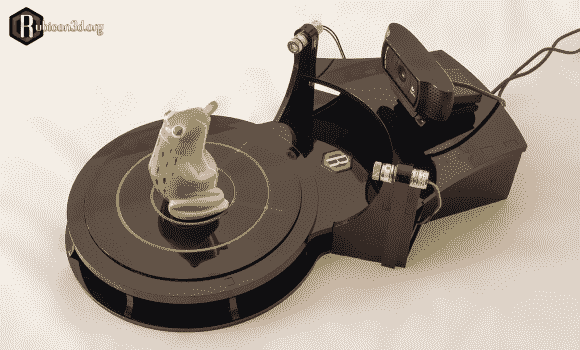

# Rubicon 为 Makerbot 数字化仪提供了资金支持

> 原文：<https://hackaday.com/2013/09/11/rubicon-gives-makerbot-digitizer-a-run-for-its-money/>

看看 MakerBot，它是一款新的 3D 扫描仪，价格大约是数字化仪的 10%。进入刚刚登陆 Indiegogo 的 Rubicon 3D 扫描仪，这款设备更接近其价值 199 美元的价格。

就像昂贵的 Makerbot 数字化仪一样，这是一个非常简单的设计，由一个网络摄像头，两条激光线和一个步进电机控制的转台组成。仍然很容易自己制作，但 199 美元，对于一个多功能套件来说，这是一个不错的价格，*尤其是*与数字化仪相比。新公司声称扫描时间快得多(3 分钟对 12 分钟)，步进旋转相同(800 步或每步 0.45 度)。没有关于设计开源的细节，但是[在 RepRap 论坛](http://forums.reprap.org/read.php?1,243606,243812)上挖了一些之后，我们发现了设计师【Robert】关于这个话题的一些讨论。

它可以扫描直径为 160 毫米、高为 250 毫米的物体，但是如果相机向后移动，它也可以扫描稍大的物体。Indiegogo 活动的资金将用于定制内置电机驱动器的 arduino-esq PCB——就个人而言，我们对自己获得 PCB 和 3D 打印扫描仪的其余部分感兴趣！

休息之后的视频中有更多信息。

[https://www.youtube.com/embed/yMrPNaFRUUk?version=3&rel=1&showsearch=0&showinfo=1&iv_load_policy=1&fs=1&hl=en-US&autohide=2&wmode=transparent](https://www.youtube.com/embed/yMrPNaFRUUk?version=3&rel=1&showsearch=0&showinfo=1&iv_load_policy=1&fs=1&hl=en-US&autohide=2&wmode=transparent)

虽然很有趣，但这项技术并不新鲜！[这里有一个 2006 年的帖子](http://hackaday.com/2006/12/21/laser-3d-scanning-with-a-webcam/)报道了大卫激光扫描仪软件的首次亮相——这是自制 3D 扫描仪的另一种选择。

你怎么想呢?199 美元是一个合理的价位吗？