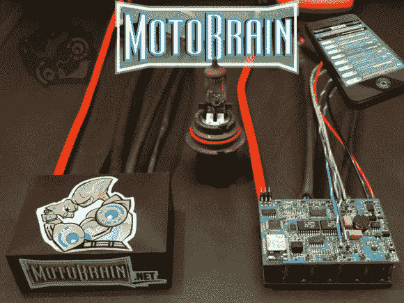

# Motobrain:蓝牙控制的 PDU

> 原文：<https://hackaday.com/2013/09/13/motobrain-a-bluetooth-controlled-pdu/>

如果你曾经考虑过改装你的汽车的电气系统，[Josh Oster-Morris 的] [Motobrain PDU](http://www.kickstarter.com/projects/craftycoder/motobrain-high-tech-automotive-power-distribution) (配电单元)可能会通过为你的汽车、自行车、船只等提供精确控制和保护辅助 12V 输出而使生活变得更容易。一旦 Motobrain 通过蓝牙与手机配对，一个配套的应用程序会显示实时遥测数据，并让您对多达 8 个输出通道进行编程。

这 8 个输出中的每一个都可以在应用程序中直接控制，但真正的力量在于 4 个可编程输入。在这里，您可以将系统连接在一起，并明确规定一个系统应该如何响应另一个系统，例如，检测远光灯和禁用您添加的辅助灯条。甚至还有一个“延迟开启”选项。编程还具有 PWM 功能，所以拨动开关可以将一些灯的亮度提高 4 级以上。如果这些灯是发光二极管，Motobrain 也可以提供符合规格的恒定电流。每个电路应该可以处理 15 安培的连续电流，并有一个可编程的断路器，这将使保险丝可选。

您可以在休息后观看一个概述视频，以更好地了解它是如何工作的，但[请访问[Josh 的]项目博客](http://www.motobrain.net/the-motobrain-pdu/)，查看多个视频和博客帖子中解释的所有功能，因为它们是开发和测试的。

[https://www.youtube.com/embed/hMizEtXfZog?version=3&rel=1&showsearch=0&showinfo=1&iv_load_policy=1&fs=1&hl=en-US&autohide=2&wmode=transparent](https://www.youtube.com/embed/hMizEtXfZog?version=3&rel=1&showsearch=0&showinfo=1&iv_load_policy=1&fs=1&hl=en-US&autohide=2&wmode=transparent)