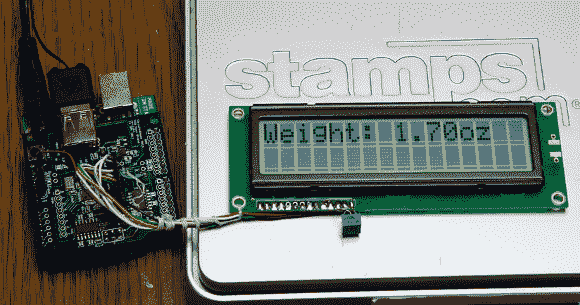

# 向 USB 数字秤添加显示器

> 原文：<https://hackaday.com/2013/09/13/adding-a-display-to-a-usb-digital-scale/>

[Oleg]发现自己拥有一台 Stamps.com 510 型 5 磅电子秤。这是一个很大的规模，但只能作为一个 USB HID 设备。换句话说，这是一个没有数字显示的数字秤。他决定让它更加独立，所以他添加了一个东芝 HD44780(兼容)显示器。一个 Arduino UNO 和 USB 主机屏蔽[被用来使它发生](https://www.circuitsathome.com/mcu/adding-a-display-to-a-digital-scale-using-arduino-and-usb-host-shield)。他的草图只是简单地轮询秤，并在显示器上输出重量。

在这种情况下，他在家里使用了 USB 主机 Shield from Circuits，但简单看一下就会发现，他们使用了与 Sparkfun 和其他版本的电路板相同的 MAX3421 控制器芯片。你也可以通过运行 V-USB 的 AVR 来实现同样的功能，尽管不可否认这并不容易。

除了像[Oleg]使用的 shields 之外，我们还没有找到一个很好的方法来将 USB 主机模式添加到项目中。如果你知道更好的方法，请在评论中分享你的想法。

当然，如果这对你来说还不够，那就忘记使用消费者秤吧—[从头开始制作自己的秤](http://hackaday.com/2013/06/12/building-a-digital-scale-from-scratch/)！