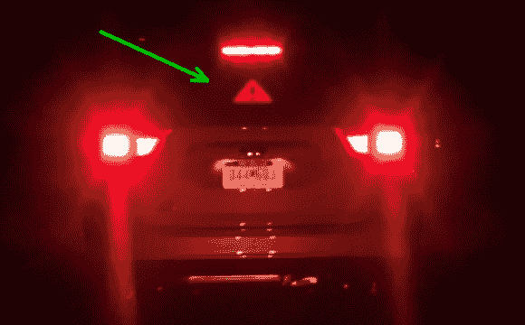

# OpenXC 智能刹车灯等

> 原文：<https://hackaday.com/2013/09/15/smart-brake-lights-and-more-with-openxc/>

在最近的一次黑客马拉松活动中，[阿尔·克林]利用 OpenXC 车载接口接入了一辆汽车的 OBD 端口，[黑进了后窗](http://ledpixelart.com/portfolio-item/smart-brake-light-prototype-2/)的 LED 屏幕，以显示基于事件的数据。如果你还没有听说过 [OpenXC](http://openxcplatform.com/) ，你可以期待在不久的将来在 Hackaday 上读到更多关于它的内容。现在，你需要知道的是 OpenXC 是福特的开源 API，用于从你的车辆获取实时数据:特别是 2010 年和更新型号的福特汽车(目前)。

[Al]通过蓝牙将 OpenXC 接口连接到他的 Android 手机，将数据从 OBD 端口实时传输到手机。从这里开始，机器人可以做一些非常酷的事情。它可以使用文本到语音来宣布你的铅脚花了你多少钱，为不同的汽车事件添加声音效果，甚至与附加设备进行交互。虽然他管理了所有这些功能，但[Al]的主要目标是添加一个 LED 屏幕，在车辆的后窗上显示信息。

当手机检测到汽车的刹车事件时，它会指示 led 灯亮起“刹车”图像，为停车过程增添一些味道。他也可以把图像变成一个挥手的“谢谢”标志，或者——对于不太礼貌的司机——一个手势略有不同的“F U”图像。在试图给你的汽车安装任何额外的照明设备之前，你会想要检查你当地和/或国家的法律，但是你可以在下面的视频中观看[Al 的]车灯。为了更详细地了解内幕，他还提供了一个[指令页面](http://www.instructables.com/id/Smart-Brake-Light-Proof-of-Concept/)。如果 OpenXC 流行起来，像[遥控车](http://hackaday.com/2013/09/01/a-real-car-remote-controlled-with-an-arduino-what-could-go-wrong/)这样的车辆黑客数量可能会激增。

[https://www.youtube.com/embed/dgYkMbLB8YM?version=3&rel=1&showsearch=0&showinfo=1&iv_load_policy=1&fs=1&hl=en-US&autohide=2&wmode=transparent](https://www.youtube.com/embed/dgYkMbLB8YM?version=3&rel=1&showsearch=0&showinfo=1&iv_load_policy=1&fs=1&hl=en-US&autohide=2&wmode=transparent)