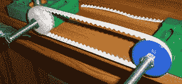
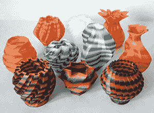

# 3D 打印:替代细丝

> 原文：<https://hackaday.com/2013/09/18/3d-printering-alternative-filaments/>

ABS 和 PLA 是 3D 打印世界的支柱。它们都很容易获得，并且对于大多数应用来说足够好。然而，它们并不是满足您所有 3D 打印需求的终极细丝。根据你的设计，你可能需要更坚韧、更灵活的东西，或者只是有不同的外观或质地。以下是一些适用于 RepRap、Makerbot 或其他 3D 打印机的替代塑料:

#### 柔软的聚乳酸

尽管较硬的塑料对工具、机械和艺术品来说很有意义，但在设计中总会用到较软的材料。这些细丝中的一种是 PLA 的衍生物，命名为“柔性 PLA”或“柔性 PLA”。这种细丝是普通的旧 PLA 细丝，混合了一种未知的化学物质，使它变得柔软、坚韧、有弹性。这是一种有趣的材料，Thingiverse 上的 BonziBrian 曾经用来打印皮带。

它还不能完全满足用于同步带等的挑战，但这种材料的硬度( [Shore D 40](http://en.wikipedia.org/wiki/Shore_durometer) ，根据一些说法)使其成为 3D 打印机器人车轮或坦克履带的完美材料。打印复杂的阴模来铸造仍然有点困难，但是如果你正在寻找一种有点弹性的材料，这就是你要找的。

Matter Hackers 发布了一个很棒的视频[，展示了软计划与常规计划的对比](http://www.youtube.com/watch?v=vr1gugI7zXg)。当然，他们也出售[软 PLA](http://www.matterhackers.com/store/3d-printer-filament/300mm-soft-pla-quarter-kg) ，还有 [Ultimaker](https://shop.ultimaker.com/en/consumables/pla-plastic-flexible-white-075.html) 、 [Maker Geeks](http://www.makergeeks.com/flecna1.html) 以及其他几家供应商。

#### 木头和石头

用仿木材料印刷[并不是什么新鲜事](http://hackaday.com/2012/09/21/3d-printer-filament-made-of-wood/)。我们已经看到了一些 Laywood(或 LAYWOO-D3)制作的印刷品，这是关于你对预示着 3D 打印木制物体的东西的预期。当材料被打印时，来自热端的热量能够改变材料的颜色，从深的、丰富的桃花心木变成浅桦木。成品材料应该感觉像中密度纤维板或宜家家具的内部，但经过一点打磨和整理，它应该被视为真正的木制物品。

如果从热的一端挤压木头还不够怪异，你现在还可以在石头上打印。Laybrick 是一种由非常细的白垩和聚合物粘合剂制成的细丝，打印时应该感觉像砂岩。冷却后，砌砖制成的任何东西都可以涂漆、打磨、钻孔或雕刻。Laybrick 最好的在线例子似乎是[这个视频](http://www.youtube.com/watch?v=cOkt9o4h6C8)正在打印一个模型石墙，但没有互联网的感觉-o-vision，可能有必要购买一个卷轴来进行实验。

#### 尼龙

除了 PLA 或 ABS，最受欢迎的长丝无疑是尼龙。这是一种比 ABS 或 PLA 更灵活、更坚固的材料，其自润滑特性非常适合齿轮和其他机械零件。尼龙印刷的第一次实验可以追溯到 RepRap 项目的早期，当时是为除草机设计的修剪器生产线。今天，事情变得更加精致了。

Taulman 很可能是互联网上最大的替代长丝供应商，销售两种不同类型的尼龙长丝。已经有很多关于尼龙的很酷的实验，特别是由[RichRap]用织物染料制作了[扎染物品](http://richrap.blogspot.com/2013/04/3d-printing-with-nylon-618-filament-in.html)。尽管一些网上建议在用尼龙打印时使用大量通风设备，但[陶尔曼]已经证实了[他的尼龙非常安全](http://www.instructables.com/id/Is-3D-Printing-Safe-or-DIY-Testing-for-HCN-from-/)，远远低于职业安全与健康管理局对有害化学物质的限制。

#### 正电子发射计算机断层扫描（Positron Emission Computed Tomography）

如果透明(或半透明，鉴于互联网上的例子数量)是你想要的，你可能会想看看 PET。这和制造塑料汽水瓶的材料是一样的，巧合的是，这也是任何灯丝回收小发明的巨大来源。

陶尔曼还提供一种叫做 t 釉的类似宠物的细丝。取决于印刷物体的填充物，它也介于透明和半透明之间，但这种材料具有更好的机械性能。它打印的零件比 ABS 更精确、更稳定，而且看起来真的很棒。

#### 聚乙烯醇

这最后一根细丝与其说是一种材料，不如说是一种工具。这是一种水溶性热塑性塑料。那么，这有什么好处呢？

虽然桥接(连接打印中两个部分的能力，有效地在 air 上打印)在过去一年左右的时间里已经变得非常非常好，但如果没有额外的支持，一些对象几乎不可能打印。如果你想打印一些疯狂的东西，比如门格尔海绵或 GEB 魔方，使用聚乙烯醇双挤压装置是一个不错的选择。

PVA 如何工作的一个更好的例子是[这里有](http://hyrulefoundry.wordpress.com/2013/06/03/pva-polyvinyl-alcohol-the-plastic-thats-afraid-of-water/)；只要把你的物体用 PVA 做支撑打印出来，扔在一杯水里几个小时，就得到一个有一堆挑檐的成品物体。但是有一个缺点——聚乙烯醇非常昂贵，大约是 ABS 或 PLA 长丝价格的两倍。话虽如此，如果你需要做一些极端突出的东西，聚乙烯醇是这样做的。

**3D 打印是一个每周专栏，深入挖掘所有与 3D 打印相关的事物。如果您对未来的分期付款有任何问题或想法，请[将您的想法发送给我们](mailto:tips@hackaday.com?Subject=[3D Printering])。**