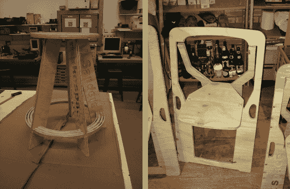

# 无胶凳子和新折叠椅的复仇

> 原文：<https://hackaday.com/2013/09/18/revenge-of-the-glueless-stool-and-a-new-folding-chair/>

[文森特]又来了，带着他的[无胶凳子的最后一次迭代和一个新项目](http://vincentsanders.blogspot.co.uk/2013/09/ever-tried-ever-failed-no-matter-try.html)。

正如你们中的许多人对[原始帖子的评论，三条腿可能不够用](http://hackaday.com/2013/08/29/many-iterations-of-a-plywood-stool-that-requires-no-glue/)。他可能已经注意到了，因为最终的设计包含的不是 3 条，不是 4 条，而是**五条**腿。休息之后，我们有一个正在使用的剪辑，它看起来非常坚固！

但就这样吗？[Vincent]完成创新木质家具了吗？没有。自从他的妻子想出了一个挑战，要创造一个实用、可折叠，尤其是不难看的椅子。他开始研究椅子的干燥主题，并确定了他的椅子应该提供的大约高度。为了与主题保持一致，他希望这把椅子是由一整块木头切割而成，就像凳子一样。几个草图之后，他已经有了一个基本的设计，仍然没有胶水，但不幸的是这一次需要铰链。在他的 CNC 程序中出现一些小问题后，他有了一把可以工作的折叠椅，但我们猜测这还不是最终的设计。

就像上次一样，[所有的文件都可以从他的 Github](https://github.com/kyllikki/designs) 中免费获得，所以如果你刚好有 CNC 路由器，或者也许是激光切割机，你可以自己制作！

[https://www.youtube.com/embed/X2KPOqQ1NqM?version=3&rel=1&showsearch=0&showinfo=1&iv_load_policy=1&fs=1&hl=en-US&autohide=2&wmode=transparent](https://www.youtube.com/embed/X2KPOqQ1NqM?version=3&rel=1&showsearch=0&showinfo=1&iv_load_policy=1&fs=1&hl=en-US&autohide=2&wmode=transparent)

【谢谢文森特！]