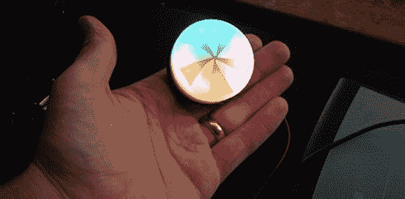

# 一个旋转的毁灭沙滩球，你可以把它放在口袋里

> 原文：<https://hackaday.com/2013/09/19/a-spinning-beachball-of-doom-that-you-can-carry-in-your-pocket/>

需要一种方式告诉世界你在精神上“出去吃午饭”了吗？或者给别人一个微妙的暗示，告诉他们你当前的思维过程比他们所说的更重要？[Caleb Kraft]——今年早些时候为了 EETimes 的一个职位而告别了 Hackaday 本周末将前往纽约的世界创客大会，他决定制造这款设备。如果你也要去 Maker Faire，请留意他引人注目的[旋转末日沙滩球](http://www.eetimes.com/author.asp?section_id=36&doc_id=1319522)。他受到了 Adafruit 的 [iCufflinks 的启发，最终设计出了一个非常棒的小设备，小到可以佩戴，或者只是为了娱乐而扔来扔去。](http://www.adafruit.com/icufflinks)

几周前，[我们将你](http://hackaday.com/2013/09/05/a-really-really-tiny-microcontroller-board/)与 Adafruit 发布他们新的[小饰品](http://learn.adafruit.com/introducing-trinket/introduction)产品线联系起来。[Caleb]立即找到了微型微控制器板的用途。他将它与 Neopixel LED 环配对，只需对测试代码做一点小小的调整，就能让它正常工作。然后，他使用 [DesignSpark Mechanical](http://hackaday.com/2013/09/13/designspark-mechanical-the-gift-of-invention/) 设计了一个 3D 打印的外壳……这是该项目的最复杂部分。他最初用纽扣电池为整个系统供电的计划没有成功，这太糟糕了，因为这本来可以是对 LED 投掷器的一次巧妙(尽管昂贵)的升级。也就是说，[Caleb]提到小型脂肪电池将是一个很好的选择。

这是一个有趣的小项目，几乎任何人都可以在一个下午完成。如果我们开始看到这些越来越多的出现，不要感到惊讶。

要查看它的实际效果，请在休息后观看视频。

[https://www.youtube.com/embed/T8fzhGMXWhA?version=3&rel=1&showsearch=0&showinfo=1&iv_load_policy=1&fs=1&hl=en-US&autohide=2&wmode=transparent](https://www.youtube.com/embed/T8fzhGMXWhA?version=3&rel=1&showsearch=0&showinfo=1&iv_load_policy=1&fs=1&hl=en-US&autohide=2&wmode=transparent)