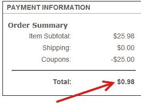

# 德州仪器商店的 25 美元优惠券代码

> 原文：<https://hackaday.com/2013/09/18/25-coupon-code-for-texas-instruments-store/>

如果你一直觊觎德州仪器的硬件，你应该在 9 月 30 日之前下订单。Stellaris ARM 社区论坛发布了购买优惠 25 美元的优惠券代码[,该代码将一直有效到该日期。以上是昨天订购两个 Tiva Launchpads 的概述(显然 TI 出于某种奇怪的原因将 Stellaris 芯片更名为 Tiva)。应用优惠券代码“National-1yr”后，[BravoV]订单的总价格不到一美元(包括运费)。下订单时，可以将优惠券代码输入到步骤#3(付款)右手栏的框中。](http://forum.stellarisiti.com/topic/1568-free-ti-launchpad-hurry)

**更新:**现在有多个评论报道优惠券代码不再有效。

我们非常确定您可以在 TI 商店的任何商品上使用此优惠券代码。但是如果你还没有 Stellaris/Tiva Launchpad，我们强烈建议你买一个。大约一年前，我们捡了我们的。这是一个尝试 ARM 编程的好方法。我们在如何组织分线接头方面遇到了一些问题——连接多个引脚存在一些问题(阅读本文中链接的[项目的最后五个段落了解更多信息)。但是对于价格和编程的简易性来说，这可以让你立刻开始编程。如果你需要一些关于如何使用董事会](http://hackaday.com/2012/12/11/level-converters-to-make-all-your-hardware-5-5v-and-under-play-with-each-other/)[的想法，看看我们标签为“stellar is”](http://hackaday.com/tag/stellaris/)的帖子。

[谢谢弗拉德]