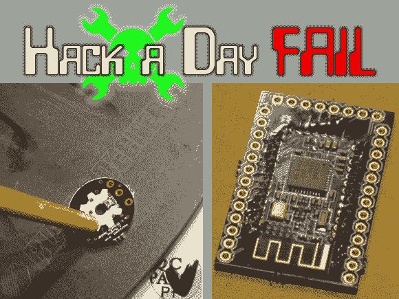

# 本周失败:吸烟脉搏传感器和 BLE 失望

> 原文：<https://hackaday.com/2013/09/19/fail-of-the-week-smoking-pulse-sensor-and-ble-dissappointment/>

我们认为(托马斯·布里泰因)说到点子上了。我们经常在我们的个人博客上发帖，这样我们就可以参考我们是如何做某事的。但他也写了一篇记录他放弃的项目的长文。如果他决定再次拿起火炬，这将是一个快速的开始。幸运的是，他在文章中提到了他的失败。在他的未完成作品页面上，这一周的失败占据了前两个位置。第一个是尝试制造自己的脉搏传感器。第二个是使用廉价蓝牙低能耗模块的悲惨体验。

对于左边的板子，[Thomas]在第一次测试中设法从组件中释放了一些烟雾。作为一次学习经历，他决定再造一个开放式硬件脉搏传感器。它由一个从光电传感器读取数据的运算放大器组成，配有一个 LED 来照亮你的指尖。他在 Eagle 展示了自己的冲浪板，并向 OSH Park 订购了 2 美元。上图显示的是[Thomas]用他的熨衣板回流光传感器。组装的其余部分完成后，他点燃了它——产生了经常提到的神奇的蓝色烟雾。电路板的第二次运行也以愚蠢告终，也许是因为他重复使用了最初“烟熏”电路板上的元件。这次失败的一个结果是[一篇关于假冒零件的有趣文章](http://makezine.com/2012/02/17/reel-crime-the-pulse-sensor-counterfeit-leds-story/)。

我们喜欢阅读关于假冒产品的文章，所以我们将在这里删除几个其他链接，指向[假冒 Arduinos](http://hackaday.com/2013/07/15/massimo-talks-about-arduino-clones/) 和[假冒苹果 PSU](http://hackaday.com/2012/10/10/raspberry-pi-foundation-looks-a-counterfeit-apple-power-supplies/)。

第二个失败是蓝牙低能耗模块从未显示出[Thomas]期望的性能。他开始这个项目的意图是直接使用 TI CC2540 无线电芯片。但当他被迫修改一个印刷成本更低的 PCB 样本时，他决定转向。没有合适的工具来排除无线电信号的故障，他认为最好用一个模块，只需制作自己的分线板。上面你可以看到 HM-10 模块焊接到他的试验板友好的 PCB(也来自奥什公园)。那些玩过蓝牙模块的人可能已经看到了这一点，但他的大部分问题是由芯片上运行的固件以及如何与固件功能交互的普遍缺乏指导引起的。此外，级别转换也是一个问题。当他最终看到设备的一些结果时，有效范围只有几英寸。

蓝牙低能耗刚刚开始在业余电子项目中出现。我们希望听到您自己对 BLE 硬件的体验，无论是好是坏。如果你有故事要分享，请留下评论。

* * *

** 每周失败是一个每周三运行的黑客专栏。通过写下你过去的失败和[给我们发送一个故事的链接](mailto:tips@hackaday.com?Subject=[Fail of the Week])，或者发送你在互联网旅行中发现的失败报道的链接，来帮助保持乐趣。**