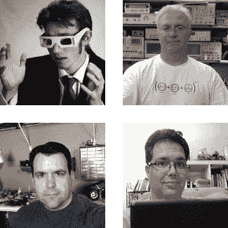

# 获得您的反馈和员工更新

> 原文：<https://hackaday.com/2013/09/20/getting-your-feedback-and-a-staff-update/>

请和我一起欢迎四位新成员加入我们的团队。大约两周前，我发表了一篇呼吁申请的帖子。我不会说我们被申请淹没了。但是我想说我们被合格的申请人淹没了。黑客写手需要成为各行各业的高手，以便从广泛的学科中识别和展示最好的黑客。为此，我们选择了对团队已经代表的领域有兴趣的作家。我对新的贡献者非常满意。请和我一起欢迎[詹姆斯·霍布森]、[托德·哈里森]、[菲利普·赖尔斯]和[亚当·法比奥]。他们已经在努力提供新的员工，但是你可以通过[阅读我们员工页面](http://hackaday.com/hackaday-staff/)上的简历来了解更多关于他们的背景。

本周你可能已经注意到了变化。虽然我们是一个总部设在美国的英语博客，但我们的统计数据显示读者遍布世界各地(事实上，我们写作团队中几乎三分之一的人不是美国人)。出于这个原因，我们在本周早些时候将我们的帖子安排改为 24 小时循环。这意味着帖子之间有更多的时间间隔，当然也意味着新的帖子会在半夜发布。请继续阅读，获取更多的花絮，并有机会向我们提供您的反馈。

我想知道你对这件事和其他几件事的看法。如果你有兴趣，请查看[这五个问题的调查](http://www.surveymonkey.com/s/K3MXRX5)。它包括对出版时间表的反馈，你是否希望我们带回你阅读 Hackaday 最多的[每周综述](http://hackaday.com/tag/weekly-roundup/)，以及提出建议或批评的机会。我将把调查结果包含在我发表的下一篇时兴类文章中。

不要错过 9 月 23 日周一即将发布的一篇特别文章。这是一系列不定期客座博文中的第一篇，旨在帮助突出你可能没有完全投入的黑客领域。我不会泄露秘密的，你必须等到太平洋时间晚上 12 点才能知道这是关于谁和什么的。

最后，我想提醒你[【Brian】和【Adam】将在本周末](http://hackaday.com/2013/09/16/hackaday-is-going-to-the-nyc-maker-faire/)参加世界创客大会。如果你参加了，留意他们得到一些 Hackaday 赃物，或炫耀你的项目。如果你不能参加，请在我们的首页关注该事件的报道。