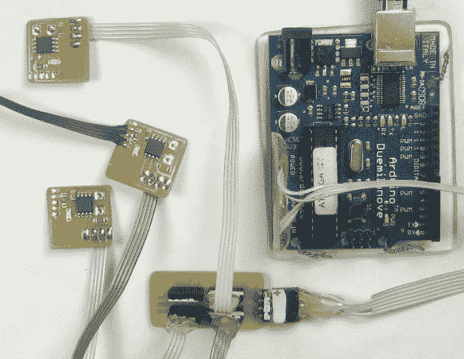

# 闹鬼的玩具屋微控制器网络世界制造商博览会

> 原文：<https://hackaday.com/2013/09/21/haunted-dollhouse-microcontroller-networking-for-world-maker-faire/>

看到世界创客大会上展示的项目数量真是太棒了。但是我们仍然喜欢挖掘那些只有深度构建文章才能提供的细节。在这里我们两者兼得。你可以在本周末 WMF 的 Circuit Castle 展览中看到上图中的电路，你也可以在[Jim]的文章中了解微控制器网络是如何构建的。

如题，这是一个为玩偶之家打造的网络。每个从设备执行不同的任务；使用一些传感器添加颜色、声音、动作和交互性。这篇文章讨论了 i2c(或 TWI，以绕过[Jim]提到的许可问题)通信，用于与从板上的 ATtiny85 芯片通信。因为 8 引脚封装只留下很少的 I/O 引脚，所以还增加了 84 引脚。它带来了 14 引脚，包括用于读取传感器的多个 ADC 输入。

如果这本书对你来说太难读了，那就去看看“2013 年 9 月 17 日更新”吧。像时间线上的任何项目一样，并不是所有事情都像他们希望的那样顺利。但正是这个过程让这样的事情变得如此有趣——一个完全工作的项目将标志着这种享受的结束，对吗？

[via[88 车间](http://blog.workshop88.com/automated-haunted-dollhouse-part-of-rachels-maker-faire-exhibit/)