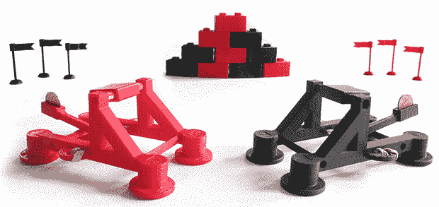

# 世界创客大会:3D 打印塔防

> 原文：<https://hackaday.com/2013/09/23/world-maker-faire-3d-printed-tower-defense/>

参加世界创客大会不仅仅是好玩和游戏；有时你不得不忍气吞声，付 130 美元的出租车费，买 7 美元的喜力啤酒，在派对后狂欢。虽然该公司很棒，但更令人兴奋的互动之一是[【吉姆·罗达】的 Seej](http://zheng3.com/2013/07/15/seej-starter-set-2013-edition/) ，这是一款完全由 3D 打印武器、旗帜和积木构建的类似塔防的游戏。

游戏的目标很简单:每个玩家得到一个 Seej 引擎、一些积木、几便士和三面旗子。第一个用弹道硬币推翻所有三面旗帜的人被宣布为获胜者。Seej 引擎不仅仅局限于上面显示的红色和黑色弹射器；有计划推出一款[弩车](http://zheng3.com/penny-ballista/)，我们确信有人会在某个时候给军火库添加一个 3D 打印的投石机。我们已经看到[至少有一个例子](http://mcad3dprintingandprototyping.blogspot.com/2011/05/3d-printed-trebuchet.html)在网络上流传。

老实说，这个游戏真的很有趣，值得一个可怜的酒保经历的挫折，我希望他今晚能得到好的小费。