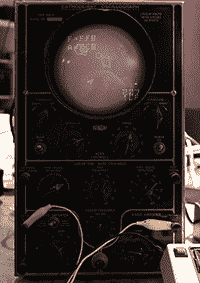
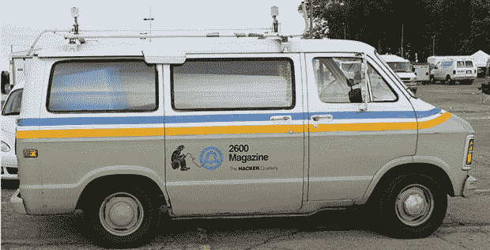

# 2013 年世界创客大会综述

> 原文：<https://hackaday.com/2013/09/25/world-maker-faire-2013-roundup/>

#### 他们只用这个工具建造了一个棚子

WMF 最有趣的建筑之一是一个完全由胶合板制成的花园小屋，用手工机器人切割而成。这是一款手持式便携式数控刳刨机，可以让你将机器放在工件上，在软件中输入一些设置，切割榫眼、数控雕刻以及你能想象到的任何其他形状。

Handibot [最近完成了一个非常成功的 Kickstarter](http://www.kickstarter.com/projects/1320575205/handibottm-a-smart-digital-power-tool) ，从它的外观来看，他们手上有一个真正伟大的工具。他们设法在他们小屋的地板上雕刻了一些 Hackaday 标志，但是我们忘记拍摄了。这是忙碌的一天。

#### 未来的船员和 1930 年的电传打字机 15 型电传打字机

来自纽约电阻区的布鲁克林黑客空间刚刚有了一个展示的机会。他们带来的一些较小的项目是[太空岩石](http://www.nycresistor.com/2013/06/08/spacerocks/)，一个小行星克隆体，在一台老旧的、慢慢报废的示波器上播放。他们还有一个为美国市场制造的迷你终端，这很奇怪。

他们为 Maker Faire 设计的令人印象深刻的大型项目是 [Future Crew](http://www.nycresistor.com/2013/06/21/future-crew/) 一款星际飞船/TARDIS bridge 模拟游戏，让五名玩家对抗一个共同的敌人:时间本身。

每个电台都有特定的任务，例如在旧的视频编辑控制台上推进时间轴，在玩具电子琴上演奏一首小曲，以及阅读 15 型电传打字机打印出的内容。所有这些站都连接到一个树莓派，游戏看起来真的很有趣，只要所有的玩家都知道发生了什么。

#### 现在我们知道 Make 对他们的网络硬件做了什么

对于任何参观过 Maker Faire 的人来说，你可能已经注意到你的 iDevice 现在位于加利福尼亚州的圣马特奥。当我的 MacBook 的时间设置为太平洋时间时，我注意到了这一点，周六早些时候在那里的其他几个人告诉我，他们的 iPhones 也在做同样的事情。

显然，在全国范围内运输一堆 WiFi 路由器(以及一堆 PA 设备和其他昙花一现的东西)比购买两套并储存起来要便宜。这有点有趣，我们现在接受建议，看看苹果/谷歌/无论什么的数据库能多快更新正确的信息。申请的截止日期是在下一届 SFO 创客节之前。

#### 世界各地的电话卡车

像往年一样， [2600](http://2600.com/) 展示了他们回收的贝尔服务车，包括“免费凯文”的保险杠贴纸。他们有一吨的赃物，包括一些旧的希望徽章，目前和过去的问题，t 恤，霍普兰德安全部门的护照和贴纸。

2600 货车确实给了我们一些想法，如果 Hackaday 需要一个展位来举办制造商博览会和其他展会。有人想做一张心形床吗？