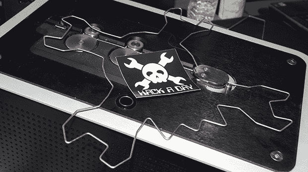

# 世界创造者大会:我们惹恼了迪威尔船员

> 原文：<https://hackaday.com/2013/09/24/world-maker-faire-we-annoy-the-diwire-crew/>

去年在 Maker Faire 上，我们遇到了来自 Pensa Labs 的人，他们是非常酷的 DIWire 数控弯线机的幕后工作人员。今年，他们带着一种新的、改进的、即将投入商业使用的弯丝机全面回归。

我们第一次看到 DIWire 时，它是一个非常酷的套件，但可能无法承受生产环境的严酷。最新版本是一台 14×8.5×5.5 英寸的机器，设计成可以放在桌子上，允许快速制造几乎任何可以想象的弯曲成 1/8”和 1/16”钢丝的形状。

使用 DIWire 制作任何形状都非常简单:如果您有一个 SVG 文件，只需将其导入软件，沿路径定义几个点，然后插入一段金属丝。来自 Pensa 的一个家伙能够在几分钟内重新创建 Hackaday 标志。

这是一个令人印象深刻的套件，一些制造商、黑客和建筑师正在使用它来建造其他方式无法建造的结构。DIWire 将很快向公众发布，所以[请访问他们的网站](http://pensalabs.com/)获取更新。