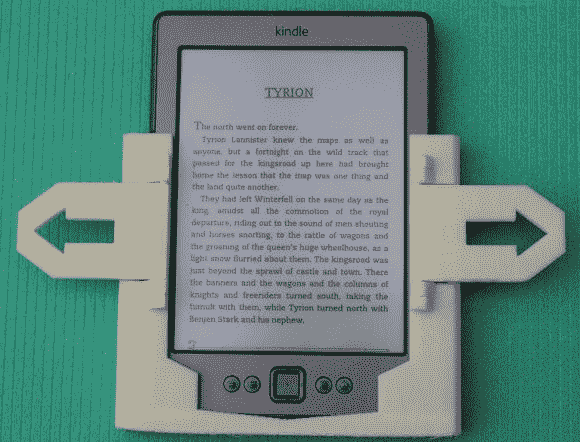

# 3D 打印 Kindle 翻页器

> 原文：<https://hackaday.com/2013/09/25/3d-printed-kindle-page-turner/>

Kindle 上细长的翻页按钮可能是一种优雅的、与众不同的设计，适合在技术中成长和渗透的一代人。然而，对于老年人和残疾人来说，这些按钮可能是一种痛苦。[XenonJohn]启动了他的 3D 打印机来寻找解决方案，建造了这个 Kindle 翻页器。Kindle 从顶部滑入，而两个 flappy 拨片提供了一个更大的，不容错过的目标，以取代通常的薄翻页按钮。[XenonJohn]将杠杆设计为只需轻轻一碰就能发挥作用，并在杠杆下方包括“缓冲挡块”，以吸收任何猛烈、意外撞击产生的多余力。

构造简单明了:打印部件，清洁部件，将部件组合在一起。杠杆通过 3D 打印铰链连接，这些铰链[XenonJohn]粘合在一起以保持位置不变。相关的 3D 文件可以在上面的链接中找到，休息后可以留下来看一个快速的视频，看看桨在翻动哪些页面。[XenonJohn]对 Hackaday 并不陌生；看看他的[谷歌眼镜替代品，“Beady-I”。](http://hackaday.com/2013/03/17/google-glass-hack-for-apple-fanboys-can-be-had-right-now/ "Google Glass hack for Apple fanboys can be had right now")也看看 [Frankenkindle](http://hackaday.com/2011/08/24/more-frankenkindle-progress/ "More FrankenKindle progress") ，这是【XenonJohn】项目的灵感之一，需要一个更具侵入性的过程来获得翻页按钮。

[https://www.youtube.com/embed/uyXspYWJEug?version=3&rel=1&showsearch=0&showinfo=1&iv_load_policy=1&fs=1&hl=en-US&autohide=2&wmode=transparent](https://www.youtube.com/embed/uyXspYWJEug?version=3&rel=1&showsearch=0&showinfo=1&iv_load_policy=1&fs=1&hl=en-US&autohide=2&wmode=transparent)