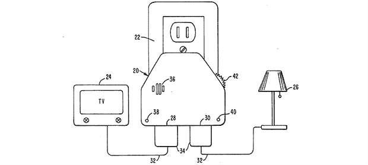

# 在剪子里

> 原文：<https://hackaday.com/2013/09/29/inside-the-clapper/>

超过一定年龄的黑客读者可能会记得约瑟夫企业开发的令人难以置信的时尚产品。这些奇怪的小玩意包括 Ove' Glove、VCR 副驾驶、木馏油清扫日志和 Chia Pet(恰恰恰恰)作为深夜广告的支柱，但没有一个像 Clapper 一样受欢迎，Clapper 是 20 世纪 80 年代以来每个人都喜欢的声音激活开关。[Richard]上传了一个很棒的响板虚拟拆卸,让我们深入了解了这个神奇的继电器盒实际上是如何工作的，以及响板被引入这个世界的一些历史背景。

声音激活开关并不是什么新鲜事，但是拍板的方式却有点高明。魔术盒内的麦克风不是听每一个声音，而是将所有声音通过一系列滤波器，形成一个以 2500 Hz 为中心的非常窄的带通滤波器。该触发由 SGS Thompson ST6210 微控制器(4MHz、~1kB ROM、64 字节 RAM 和 12 个 I/O 引脚)分析，以在 200 毫秒内监听两个重复的触发。整个系统——包括 MCU 的源代码——可以在官方专利 [US5493618](https://www.google.com/patents/US5493618?) 中看到。

克拉珀卖了几百万台，而当时许多家庭确实处于微电子学出现之前的世界。是的，在 1986 年，许多电视都有微控制器，也许洗衣机/烘干机组合之间可能有几千个晶体管。除此之外，Clapper 是许多家庭对我们今天看到的无处不在的计算能力的介绍，所有这些功能都不如 Arduino。