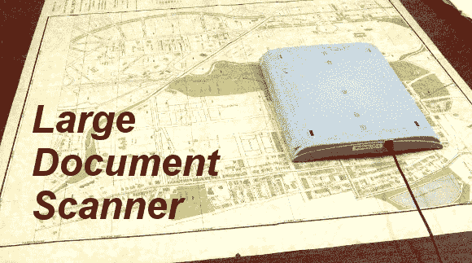

# 黑进平板扫描仪扫描非常大的文件

> 原文：<https://hackaday.com/2013/09/27/hacking-a-flatbed-scanner-to-scan-very-large-documents/>

当你需要扫描非常大的文件时，相机的设置会变得非常昂贵。有专业人士这样做，但他们也相当昂贵。如果您需要以较低的成本完成，该怎么办？平板扫描仪将是完美的，但大多数平板扫描仪边缘的边缘使文档无法正确接触压盘。[马修]决定[黑掉他的佳能 LiDE 90 扫描仪](http://www.mpetroff.net/archives/2013/09/25/scanner-modifications-to-scan-large-documents/)，以正面朝下的格式使用。通过移除外壳的顶部，并进行一些额外的调整，扫描仪现在可以平放，只需在网格中移动。

一旦你有了图像，你就需要一种方法将它们拼接在一起。[Matthew]指向了本教程的[，但是他令人惊叹地决定给](http://hugin.sourceforge.net/tutorials/scans/en.shtml)[写一个小 Python 脚本](https://github.com/mpetroff/stitch-scanned-images)来让这一切自动发生。我们认为这个脚本可能不仅仅在这个项目中有用。

最近，我们已经看到了一些 [和其他](http://hackaday.com/2013/09/24/priceless-paintings-scanned-and-printed-in-3d/)扫描仪，但这款可能是大多数业余爱好者手头上最容易实现的。