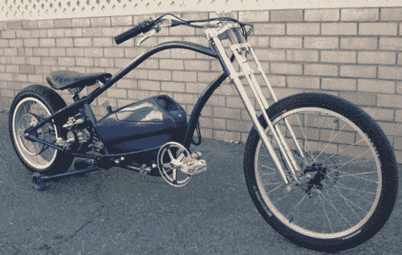

# 定制 E-Cruiser 具有针对残疾骑手的功能

> 原文：<https://hackaday.com/2013/09/28/custom-e-cruiser-has-features-for-disabled-rider/>

正如[AussieJester]在他的建造日志的第一页中所指出的，大多数人对“定制”电动自行车的想法包括将一些电子设备和一个轮毂电机捆绑到任何现成的自行车上。他需要更大的挑战，所以他自己组装了一辆时髦的电动巡洋舰。这辆自行车有一个 2 速变速器和一个巨大的 Turnigy 80-100 无刷 outrunner 电机，最高时速可达 45 英里。

你可能已经注意到了上图中看起来像训练轮的东西，那你就对了一半。[AussieJester]是一名截瘫患者，无论是从轮椅上转移还是停下来，都需要保证一定的稳定性。然而，这辆自行车最大的特点是这些小轮子是可伸缩的。线性致动器降低了它们的速度和安装/拆卸，但一旦你达到速度，就会将它们从地面上拉回来，保持真正的双轮体验。

休息后留下来看几个视频:第一人称视角展示这辆自行车可以移动多快，以及致动器的演示。然后看看另一个滑板世界的先驱。

[https://www.youtube.com/embed/KxNta7yGY2A?version=3&rel=1&showsearch=0&showinfo=1&iv_load_policy=1&fs=1&hl=en-US&autohide=2&wmode=transparent](https://www.youtube.com/embed/KxNta7yGY2A?version=3&rel=1&showsearch=0&showinfo=1&iv_load_policy=1&fs=1&hl=en-US&autohide=2&wmode=transparent)

[https://www.youtube.com/embed/AOl6uoaIVBc?version=3&rel=1&showsearch=0&showinfo=1&iv_load_policy=1&fs=1&hl=en-US&autohide=2&wmode=transparent](https://www.youtube.com/embed/AOl6uoaIVBc?version=3&rel=1&showsearch=0&showinfo=1&iv_load_policy=1&fs=1&hl=en-US&autohide=2&wmode=transparent)

[通过[谢尔比电子](https://sites.google.com/site/shelbyelectro/Bike-of-the-week/aussiejesterscruiser)和【electricbike.com】T2

[谢谢以斯拉]