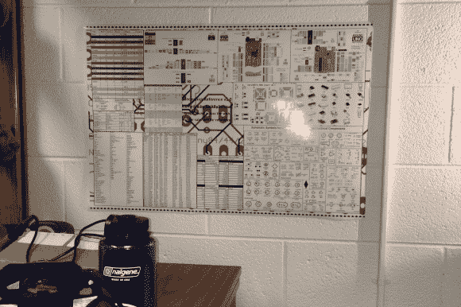

# 电子一切参考海报

> 原文：<https://hackaday.com/2013/09/28/electronics-everything-reference-poster/>

[Ben]刚刚给我们发了一份很棒的参考资料。这是一张由数据表和各种电子参考资料组成的海报。他在做项目时花了太多时间筛选数据表，终于成功了。这也有助于他意识到他的学校，佐治亚理工学院，有海报印刷服务！

它包含电阻颜色代码、各种芯片的典型引脚排列、线规的电流容量、Arduino 引脚排列图、原理图符号、电流容量的走线宽度，甚至典型的编码功能！

完整的图像是 9,000 x 6,000 像素，在 30 x 20 英寸的尺寸下打印效果很好，略小于 ANSI D 纸的尺寸。它的大小是 6.1MB，所以如果你想要它，只需[点击这里](http://builtbybendotnet.files.wordpress.com/2013/09/electronicsposterv2.jpg)！

也许如果我们友好地请求，他会共享原始的 MS Publisher 文件，这样我们就可以根据我们的个人需求对其进行裁剪！图像中的一些文字有点模糊，但基本上仍然可读。